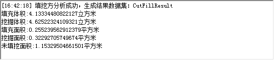

###  使用说明

用于描述两个栅格数据集（填挖方前和填挖方后栅格数据集）之间体积和面积的变化，“填方”表示表面区域物质的增加，“挖方”表示表面区域物质的减少。填挖方的计算结果由填挖方后的数据与填挖方前的数据相减得出。关于填挖方的原理和方法介绍，请参见
**关于表面分析** 的[表面填挖方](AoubtSurfaceAnalyst)部分。

对于输入的两个栅格数据集及结果数据集有几点内容需要注意：

  1. 要求两个输入的栅格数据集有相同的坐标和投影系统，以保证同一个地点有相同的坐标，如果两个输入的栅格数据集的坐标系统不一致，则很有可能产生错误的结果。
  2. 理论上，要求输入的两个栅格数据集的空间范围也是一致的。对于空间范围不一致的两个栅格数据集，只计算其重叠区域的表面填挖方的结果。
  3. 若参与计算的一个栅格数据集某处的像元值为空值，则结果数据集中该处像元值也为空值。

###  功能入口

  * 在 **空间分析** 选项卡-> **栅格分析** -> **表面分析** -> **填挖方** ；
  * **工具箱** -> **栅格分析** 工具-> **表面分析** -> **地形计算** -> **填挖方** 。(iDesktopX)

###  主要参数

  * 设置填挖方前的栅格数据集。 
    * **数据源** ：列出了当前工作空间中所有的数据源，选择填挖方前栅格数据集所在的数据源。
    * **数据集** ：列出了当前数据源中所有的栅格数据集（GRID），在列表中选择填挖方前栅格数据集。这里会自动定位到工作空间管理器内选中的数据集。
  * 设置填挖方后的栅格数据集。 
    * **数据源** ：列出了当前工作空间中所有的数据源，选择填挖方后栅格数据集所在的数据源。默认与源数据源相同。
    * **数据集** ：列出了当前数据源中所有的栅格数据集（GRID），在列表中选择填挖方后栅格数据集。
  * 设置结果数据。 
    * **数据源** ：列出了当前工作空间中所有的数据源，选择结果数据集所在的数据源。默认与源数据源相同。
    * **数据集** ：设置结果数据集的名称。结果数据集由填挖方数据与源数据相减得出。
  * **在地图中展示结果** ：运行结束后，将结果数据集在当前地图窗口中打开。其中，挖方部分用红色表示，填方部分用绿色表示，白色表示未变化的区域，既没有挖方也没有填方的区域。
  * **在场景中展示结果** ：运行结束后，将结果数据集在当前场景窗口中打开。
  * 单击“确定”按钮，执行填挖方操作。 

执行完毕后会在输出窗口显示填挖方计算结果，包括填充体积、挖掘体积、填充面积、挖掘面积、未填挖面积5项内容，其中体积单位为立方米、面积单位为平方米。如下图所示：

  

###  相关主题

 [反算填挖方](InverseCutFill)

 [关于表面分析](AoubtSurfaceAnalyst)