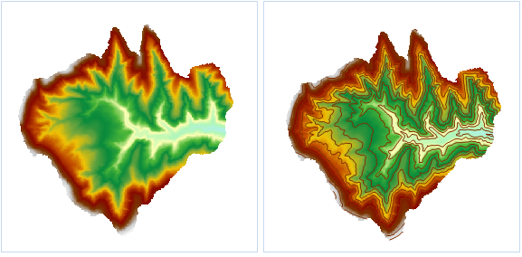

### 使用说明

提取所有等值线通过指定参数提取表面模型中所有的符合条件的等值线。

* 用于提取等值线的源数据集必须为 DEM 或 Gird 数据集。

### 操作步骤

1. 使用桌面软件打开“SampleData/ExerciseData/RasterAnalysis”文件夹下的“Terrain”数据源，其中有分辨率为 5 米的 DEM 数据，我们用此数据来做示例。
2. 单击“ **空间分析** ”选项卡中“ **栅格分析** ”组的“ **表面分析** ”按钮，在弹出的下拉菜单中选择“ **提取所有等值线** ”项，进入“提取所有等值线”对话框。
3. 设置提取等值线的公共参数，包括源数据、目标数据和参数设置中的重采样系数、光滑方法、光滑系数。源数据、目标数据和参数设置等公共参数的设置请参见：[公共参数说明](CommonPara.htm)。
4. 设置参数中的基准值和等值距。

**基准值：**
生成等值线时的初始起算值，以等值距为间隔向前或前后两个方向计算，因此不一定是最小等值线的值。可以输入任意数字作为基准值。默认值为0。例如，高程范围为220-1550的
DEM 数据，如果设置基准值为500，等值距为50，则提取等值线的结果是：最小等值线值为250，最大等值线为1550.

**等值距：** 两条等值线之间的间隔值，它与基准值共同决定提取哪些等值线。

参数设置完成后，系统会自动计算出结果信息并显示出来。结果信息的说明如下：

**栅格最大值：** 所选源数据集中最大的栅格值，为系统信息，不可更改。

**栅格最小值：** 所选源数据集中最小的栅格值，为系统信息，不可更改。

**最大等值线：** 目标数据集中等值线的最大值。

**最小等值线：** 目标数据集中等值线的最小值。

**等值数：** 目标数据集中等值线的总数目。

5. 单击“确定”按钮，完成等值线提取操作。
  
     

###  相关主题

 [关于表面分析](AoubtSurfaceAnalyst.htm)

 [提取指定等值线](DriveContourSpecific.htm)

 [点选提取等值线](DriveContourPoint.htm)
