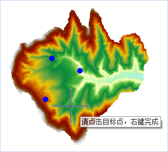
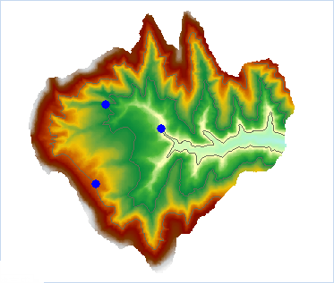

###  使用说明

点选提取等值线提取与鼠标点击位置处高程值相等的所有等值线。

  * 用于提取等值线的源数据集必须为 DEM 或 Gird 数据集。

**应用实例**

打开“ExerciseData/RasterAnalysis”文件夹下的“Terrain”数据源，其中有分辨率为5米的 DEM 数据，我们用此数据来做示例。

###  功能入口

  * 在 **空间分析** 选项卡-> **栅格分析** -> **表面分析** -> **点选提取等值线** ；

###  操作说明

  1. 将鼠标移至地图上，此时鼠标状态会变成十字，在地图上单击选择一个或者多个需要提取等值线的点，如下图所示：
  
---  
  2. 选择完毕后，单击鼠标右键弹出“点选提取等值线”对话框，对话框中显示选取点的坐标值以及栅格值；
  3. 设置提取等值线的公共参数，包括目标数据和参数设置中的重采样系数、光滑方法、光滑系数，参数描述请参见：[公共参数说明](CommonPara)。
  4. 单击“确定”按钮，完成等值线提取操作，结果如下图所示。

  

###  相关主题

[关于表面分析](AoubtSurfaceAnalyst)

[提取所有等值线](DriveContourAll)

[提取指定等值线](DriveContourSpecific)