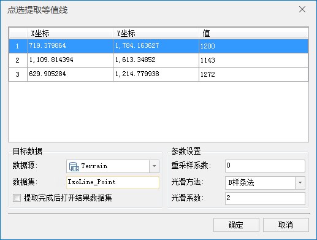

### 使用说明

点选提取等值线提取与鼠标点击位置处高程值相等的所有等值线。

* 用于提取等值线的源数据集必须为 DEM 或 Gird 数据集。

### 操作步骤

1. 在SuperMap iDesktop 中打开“ExerciseData/RasterAnalysis”文件夹下的“Terrain”数据源，其中有分辨率为5米的 DEM 数据，我们用此数据来做示例。
2. 单击“ **空间分析** ”选项卡中“ **栅格分析** ”组的“ **表面分析** ”下拉按钮，在弹出的下拉菜单中选择“ **点选提取等值线** ”项。
3. 将鼠标移至地图上，此时鼠标状态会变成十字，在地图上单击选择一个或者多个需要提取等值线的点，如下图所示：  

  

4. 选择完毕后，单击鼠标右键弹出“点选提取等值线”对话框，如下： 

  

5. 单击“确定”按钮，完成等值线提取操作，结果如下图所示。  

  

图：点选提取等值线结果  

###  相关主题

 [关于表面分析](AoubtSurfaceAnalyst.htm)

 [提取所有等值线](DriveContourAll.htm)

 [提取指定等值线](DriveContourSpecific.htm)

