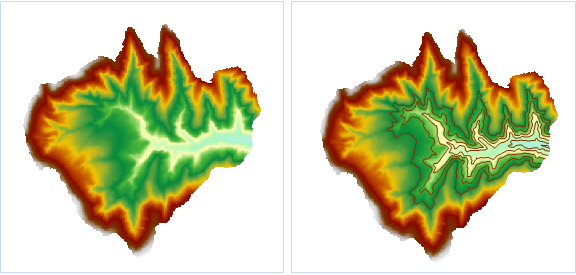

### 使用说明

提取指定线，即提取指定等值线，可以按照用户的需要提取一定数量的特定值的等值线。可以直接输入特定值，也可以根据设置的范围和间隔自动生成系列特征值，还可以通过导入的方式，将存放在*.txt
文件中的特定值导入。

  * 用于提取等值线的源数据集必须为 DEM 或 Gird 数据集。

**应用实例**

打开“ExerciseData/RasterAnalysis”文件夹下的“Terrain”数据源，其中有分辨率为5米的 DEM 数据，我们用此数据来做示例。

### 功能入口

  * 在 **空间分析** 选项卡-> **栅格分析** -> **表面分析** -> **提取指定线** ；
  * **工具箱** -> **栅格分析** 工具-> **表面分析** -> **提取等值线/面** -> **提取指定线** 。(iDesktopX)

### 操作说明

  * 在“提取指定等值线”对话框中输入特定值，也可单击“批量添加”按钮，弹出“批量添加栅格值”对话框，设置等值线的起始值、终止值、等值距、等值数等参数，单击“确定”按钮，返回“提取指定等值线”对话框。

**起始值：** 生成等值线的初始起算值。

**终止值：** 生成等值线的最大值。

**等值距：** 相邻两条等值线之间的间隔值。

**等值数：** 目标数据集中等值线的总数量。等值距确定后，系统会自动计算出等值数。

这里将起始值设置为1100，终止值设置为1200，等值距设置为20，表示提取1100-1200之间距离为20的6条等值线。

  * 设置提取等值线的公共参数，包括源数据、目标数据和参数设置中的重采样系数、光滑方法、光滑系数。源数据、目标数据和参数设置等公共参数的设置请参见：[公共参数说明](CommonPara)。
  * 在提取指定等值线时，可以导入、导出 txt 格式的等值线信息，也可以删除一个或者全部的当前等值线信息。工具栏中的按钮自左至右依次对应导入、导出、删除、全部删除操作。
  * 单击“确定”按钮，完成等值线提取操作。  

    

###  相关主题

[关于表面分析](AoubtSurfaceAnalyst)

[提取所有等值线](DriveContourAll)

[点选提取等值线](DriveContourPoint)

