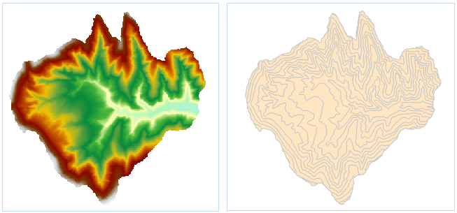

### 使用说明

提取所有面，即提取所有等值面，通过指定参数提取表面模型中所有的符合条件的等值面。

  * 用于提取等值面的源数据集必须为 DEM 或 Gird 数据集。

**应用实例**

打开“ExerciseData/RasterAnalysis”文件夹下的“Terrain”数据源，其中有分辨率为5米的 DEM 数据，我们用此数据来做示例。

### 功能入口

  * 在 **空间分析** 选项卡-> **栅格分析** -> **表面分析** -> **提取所有面** ；
  * **工具箱** -> **栅格分析** 工具-> **表面分析** -> **提取等值线/面** -> **提取所有面** 。(iDesktopX)

### 主要参数

  * 设置包括源数据、目标数据和参数设置中的重采样系数、光滑方法、光滑系数。源数据、目标数据和参数设置等公共参数的设置请参见：[公共参数说明](CommonPara)。
  * 设置参数中的基准值和等值距。

    * **基准值：** 基准值作为一个生成等值面的初始起算值，以等值距为间隔向其前后两个方向计算，因此并不一定是最小等值面的值。
    * **等值距：** 从基准值起，相邻两个等值面之间的高程间距，默认单位与源数据集单位相同。它与基准值共同决定提取哪些等值面。

  * 参数设置完成后，系统会自动计算出结果信息并显示出来。结果信息的说明如下：
    * **栅格最大值：** 所选源数据集中最大的栅格值，为系统信息，不可更改。
    * **栅格最小值：** 所选源数据集中最小的栅格值，为系统信息，不可更改。
    * **最大等值面：** 目标数据集中等值面的最大值。
    * **最小等值面：** 目标数据集中等值面的最小值。
    * **等值数：** 目标数据集中等值面的总数量。

  * 点击“确定”按钮，完成等值面提取操作，结果如下图所示：

  

###  相关主题

[关于表面分析](AoubtSurfaceAnalyst)

[提取指定等值面](DriveRegionSpecific)
