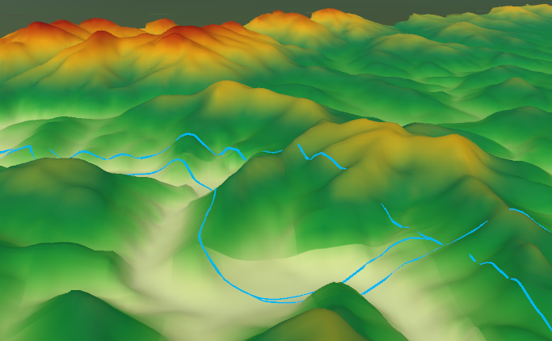

### 使用说明

提取三维矢量数据是通过提取 DEM 栅格数据中的 Z 字段（高程信息），使二维点、线、面数据等矢量数据获得高程值，从而生成新的三维矢量数据。

* 生成的三维矢量数据包含了二维数据集的字段和其属性信息，另外在数据对象即相应的节点信息中会增加一个 Z 坐标（高程信息）。用户可选中对象在属性窗口查看该对象的节点信息。
* 当结果数据为三维点数据集时，在数据对象的节点信息下新增一个高程字段，数据集属性表中也会增加一个高程 SmZ 字段。新生成的 SmZ 字段默认为系统字段，用户可在属性表中“取消隐藏”操作，即可看到该字段的信息。

### 操作步骤

1. 通过 SuperMap iDesktop 打开待提取数据的工作空间，该工作空间中必须包含提取数据范围的 DEM 栅格数据。
2. 单击“ **空间分析** ”选项卡中“ **栅格分析** ”组的“ **表面分析** ”下拉按钮，在弹出的下拉菜单中选择“ **提取三维数据** ”项，进入“提取三维矢量数据”对话框。

3. 设置提取三维矢量数据的参数信息，包括 DEM 数据、二维矢量数据和参数设置中的高程缩放系数、插值距离等。

**DEM 数据：** 指定待提取高程信息的 DEM 栅格数据。

**二维矢量数据：** 指定二维点、线、面矢量数据集。

**高程缩放系数：** 该值是指在 DEM 栅格中，栅格值（Z 坐标，即高程值）相对于 X 和 Y 坐标的单位变换系数。通常有 X，Y，Z
都参加的计算中，需要将高程值乘以一个高程缩放系数，使得三者单位一致。例如，X、Y 方向上的单位是米，而 Z 方向的单位是英尺，由于 1 英尺等于
0.3048 米，则需要指定缩放系数为 0.3048。如果设置为 1.0，表示不缩放。

**仅对线和面边界的已有节点插值：** 勾选该复选框，程序在提取线数据集和面数据集的高程信息时，只对线对象和面对象的节点提取高程信息。

**插值距离：** 勾选该复选框，则提取的三维线、面数据会根据指定插值距离提取距离点处的高程信息。该值默认为 DEM 栅格数据的分辨率。

4. 设置结果数据源及数据集名称，点击“确定”按钮，完成提取三维矢量数据操作。 

以提取某区域铁路线数据集为例，将提取后的三维线数据加载到场景中显示。在“风格设置”选项卡中将“高度模式”设置为非贴地模式，则三维数据对象会按照 在 z
坐标的数值显示该点的高度。如图所示：

  

###  相关主题

 [关于表面分析](AoubtSurfaceAnalyst.htm)

 [提取指定等值面](DriveRegionSpecific.htm)
