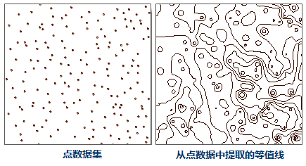
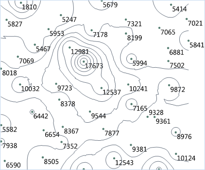

###  使用说明

提取点数据集等值线要先对点数据集进行插值分析，得到栅格数据集，将栅格数据集中相邻的具有相同高程值的点连接起来，提取高程值相等点的等值线。

SuperMap桌面产品目前支持从二维点数据集、三维点集合中提取等值线。二维点数据集使用某个字段来存储用于提取等值线的属性信息，如高程、温度等，三维点集合中除了点的坐标信息外，还存储了第三维信息。从点数据中提取等值线的原理是，对点数据集、三维点集合进行插值，得到栅格数据集，再从栅格数据集提取等值线。

点数据中分散分布的点能够很好的表现位置信息，但对于点本身的其他属性信息却不能直观的体现，例如，已经获取了某个研究区域的大量采样点的高程信息，如下图所示，从左图的点数据上并不能看出地势高低起伏的趋势，若运用等值线的原理，将这些点数据所蕴含的信息以等值线的形式表现出来，即将相邻的具有相同高程值的点连接起来，形成右图所示的等高线图，这个区域的地形信息便可明显的表现出来。不同的点据提取的等值线具有不同的含义，主要依据点数据所代表的信息而定，如果点的值代表温度，那么提取的等值线就是等温线；如果点的值代表雨量，那么提取的等值线就是等降水量线，等等。

   
  
**应用实例**

打开“ExerciseData/RasterAnalysis”文件夹下的“Precipitation”数据源，其中有部分地区气象监测站点的降水量数据，我们用此数据来做示例。

###  功能入口

  * 在 **空间分析** 选项卡-> **栅格分析** -> **表面分析** -> **点数据提取线** ；
  * **工具箱** -> **栅格分析** 工具-> **表面分析** -> **提取等值线/面** -> **点数据提取线** 。(iDesktopX)

###  主要参数

* **源数据**
   - **数据源** ：要进行等值线提取的数据集所在的数据源。

   - **数据集** ：要进行等值线提取的数据集。在选中提取操作的数据源后，系统会自动过滤数据集，只显示该数据源下的二维和三维点数据集。
   - **属性字段** ：要进行插值分析的属性字段，一般设置为高程字段。在提取等值线时，将用该字段中的值，对点数据集中的点数据进行插值分析。

* **结果数据**

   - **数据源** ：提取的等值线数据集要存放在的数据源。

   - **数据集** ：提取等值线结果要保存的数据集名称。如果输入的数据集名称已经存在，则会提示数据集名称非法，需重新输入。默认数据集名称为：IsoLine。

   - **最大等值线** ：显示目标数据集中等值线的最大值。

   - **最小等值线** ：显示目标数据集中等值线的最小值。

   - **等值数** ：显示目标数据集中等值线的总数目。

* **参数设置**
   - **插值类型**：若源数据集为三维点数据集，则可选择距离反比权值法(IDW)、克吕金内插法(Kriging)或者不规则三角网(TIN)其中的一种插值法，对数据进行插值。
     * IDW 通过计算附近区域离散点群的平均值来估算单元格的值，是一种简单有效的数据插值方法，运算速度较快。
     * Kriging 与普通克吕金插值方法思路一样，数据结构简单，非常适用于大区域宏观地形的构建。
     * TIN 需要先将给定的线数据集生成一个 TIN 模型，然后根据给定的极值点信息（可选）以及湖信息（可选）生成地形。TIN 模型能够较好地反映地形特征，但是数据结果复杂，适用于小区域地形的计算。
   - **分辨率** ：对点数据集进行插值分析的中间结果（栅格数据集）的分辨率。当插值类型为TIN时，分辨率不可设置。
   - **基准值**：生成等值线时的初始起算值，以等值距为间隔向前或前后两个方向计算，因此不一定是最小等值线的值。可以输入任意数字作为基准值。默认值为0。例如，高程范围为220-1550的 DEM 数据，如果设置基准值为500，等值距为50，则提取等值线的结果是：最小等值线值为250，最大等值线为1550。
   - **等值距** ：两条等值线之间的间隔值，它与基准值共同决定提取哪些等值线。
* 设置重采样系数、光滑方法、光滑系数等参数，请参见：[公共参数说明](CommonPara)。
* 单击“确定”按钮，完成等值线提取操作。将结果数据在地图窗口中打开，即可看到等值线提取结果，如下图所示：

  

###  相关主题

 [关于表面分析](AoubtSurfaceAnalyst)

 [提取所有等值线](DriveContourAll)

 [提取指定等值线](DriveContourSpecific)

 [点选提取等值线](DriveContourPoint)
