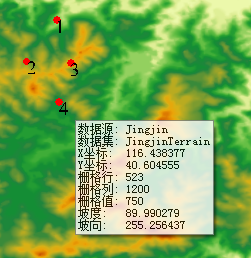
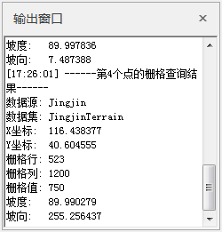

###  使用说明

查询鼠标所在位置的栅格值。默认查询结果会显示该栅格单元所在的数据源、数据集、X坐标、Y坐标、栅格行、栅格列、栅格值、坡度以及坡向值。支持对镶嵌数据集进行栅格查询。

###  功能入口

* 在 **空间分析** 选项卡-> **栅格分析** -> **栅格查询** ；

###  操作说明

* 在移动鼠标的过程中，在鼠标尾部出现即时消息框，实时显示鼠标所在位置的栅格值信息，包括栅格数据所在的数据源、数据集，该栅格位置的地理坐标（X和Y坐标）、栅格坐标（行号和列号）、栅格值以及坡度、坡向值，如下图所示。

  
 
* 点击“栅格查询”功能的下拉按钮，会弹出栅格查询设置对话框，可设置在查询时是否显示栅格信息、显示坡度坡向值等信息。 
    * **显示栅格信息** ：勾选该复选框则表示查询结果会显示鼠标所在单元格的栅格行、栅格列、栅格值信息；不勾选该复选框则表示查询结果中不显示栅格信息。
    * **显示坡度坡向值** ：勾选该复选框则表示查询结果会显示鼠标所在单元格坡度坡向值；不勾选该复选框则表示查询结果中不显示坡度坡向值。
    * **高程缩放系数** ：当地形栅格值（即高程值）的单位与 x，y 坐标的单位不相同时，通常需要将高程值乘以一个高程缩放系数，使得三者单位一致。例如，X、Y 方向上的单位是米，而 Z 方向的单位是英尺，由于 1 英尺等于 0.3048 米，则需要指定缩放系数为 0.3048。如果设置为 1，表示不缩放。 

建议进行分析的数据为投影坐标系统（单位：米）。如果选择使用球坐标系运行分析，需要为该纬度指定一个适当的 z 因子。如果 x,y 单位是经纬度而 z
单位是米，则可使用下表列出的某些适当的 z 因子：        
                
     **Latitude**     **Z-factor**
          0         0.00000898
          10         0.00000912
          20         0.00000956
          30         0.00001036
          40         0.00001171
          50         0.00001395
          60         0.00001792
          70         0.00002619
          80         0.00005156
        
        

* 使用鼠标单击想要查询的栅格值，则会在地图窗口上高亮添加一个点，同时在输出窗口会显示该点的地理坐标、栅格坐标以及栅格值。 如果同时查询了多个栅格点，则会自动给这些点编号，方便用户区分。
 
   

* 按住 ESC 键或者单击鼠标右键可以取消查询，且按住 ESC 键可以同时清除地图窗口高亮的栅格点。

###  相关主题

 [栅格查询设置](FindRasterVauleSetting)

 [关于表面分析](AoubtSurfaceAnalyst)
