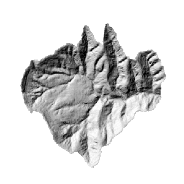

### 使用说明

“三维晕渲图”功能，通过为栅格表面中的每个像元确定照明度，来获取表面的假定照明度。通过设置假定光源的位置和计算与每个像元的照明度值，即可得出假定照明度。进行分析或图形显示时，特别是使用透明度时，“三维渲染图”可大大增加栅格表面的立体显示效果。关于三维晕渲图的详细介绍，请参见[三维晕渲图](AboutHillShade)中的介绍内容。

**应用实例**

打开“ExerciseData/RasterAnalysis”文件夹下的“Terrain”数据源，其中有分辨率为5米的 DEM 数据，我们用此数据来做示例。

###  功能入口

  * 在 **空间分析** 选项卡-> **栅格分析** -> **表面分析** -> **三维晕渲图** ；
  * **工具箱** -> **栅格分析** 工具-> **表面分析** -> **地形计算** -> **三维晕渲图** 。(iDesktopX)

###  主要参数

**光源参数设置**

  * **方位角** ：方位角由0-360度之间的正度数表示，以北方向为基准方向按顺时针进行测量。
  * **高度角** ：高于地平线的光源高度角。高度角由正度数表示，0度表示地平线，90度表示头顶正方向。

**参数设置**

  * **阴影模式** ：三维晕渲图有三种类型：渲染阴影效果、渲染效果和阴影效果。 
    * **渲染和阴影** ：同时考虑当地的光照角及阴影的作用。
    * **阴影** ：只考虑当前区域是否位于阴影中。
    * **渲染** ：只考虑当地的光照角。
  * **高程缩放倍数** :栅格表面中，栅格高程值（Z 值）相对于 X 和 Y 坐标的单位变换系数。当 Z 方向的单位与栅格表面的 X，Y 单位不同时，可使用高程缩放倍数进行调整。 
    * 如果 X，Y 单位与 Z 单位相同，则高程缩放系数为1，表示不缩放。
    * 如果 X，Y 单位与 Z 单位使用不同的测量单位，则必须使用适当的高程缩放系数，否则可能会得到错误的结果。例如，X，Y 方向上的单位是米，而Z方向的单位为英尺，由于1英尺=0.3048米，则需要制定高程缩放系数为0.3084，将英尺单位转换为米。

**结果数据**

  * **数据源** ：列出了当前工作空间中所有的数据源，选择结果数据集所在的数据源。默认与源数据源相同。
  * **数据集** ：设置结果数据集的名称。新生成的晕渲数据集是一个和源数据集等大且分辨率相同的数据集。

单击“确定”按钮，执行生成晕渲图的操作。

  

  
###  相关主题
[三维效果图概述](AboutHillShade)    

[生成正射三维影像](OrthoImage)

