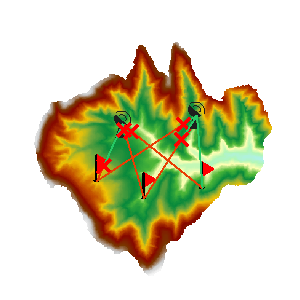

###  使用说明

多点可视性分析是对多个观察点和被观察点，在输入的栅格数据表面上的通视性进行分析，即能否两两相互通视。

  * 当前地图窗口中必须存在 Grid/DEM 数据集时，才可以使用通视分析功能。
  * 附加高程值作为观察点的总高程组成部分之一，对通视分析的结果有重要影响，因此需要了解观察点的表面高程值以及附加高程值，以保证分析结果更符合实际情况。
  * 当有多个观察点时，会对所有观测点的两两之间的可视性进行分析。

**应用实例**

打开“ExerciseData/RasterAnalysis”文件夹下的“Terrain”数据源，其中有分辨率为5米的 DEM 数据，我们用此数据来做示例。

###  功能入口

  * 在 **空间分析** 选项卡-> **栅格分析** -> **表面分析** -> **多点可视性** ；

###  主要参数

  * 指定当前分析图层：若当前地图窗口中有多个栅格图层，需要在此处选择想要对哪个图层进行可视性分析。
  * 指定观测点：可以通过鼠标点击的方式添加，也可以直接导入点数据集作为观测点。在“多点可视性分析”对话框中，单击“鼠标点击加点”按钮，鼠标状态变为添加状态，即可在栅格表面单击鼠标选取观察点。选定的观察点会在地图上用蓝色高亮标识。
  或者在工具条中使用导入功能导入观察点。对话框上方的工具条提供了“鼠标单击加点”按钮、“全选”按钮、“反选”按钮、“删除”按钮、“导入”按钮、“导出”按钮和“统一设置”按钮。
    * “导入”按钮：用来导入点数据集中点导入，作为观察点和被观察点进行分析。此数据集中必须包含附加高程字段和角色字段。单击“导入”按钮，弹出“导入数据”对话框，在该对话框中设置要导入的数据集，附加高程值、角色信息对应的字段、以及过滤表达式等。 
    * “导出”按钮：将当前地图窗口中添加的点导出为点数据集，并将附加高程信息和角色信息保存在属性表中。单击“导出”按钮，弹出“导出数据”对话框，在该对话框中设置导出的点数据集的信息，包括数据集的名称、附加高程字段名称和角色字段名称，如下图所示。
    * “设置”按钮：当在对话框中选中了一条或多条记录后，单击该按钮，弹出“批量参数设置”对话框，统一设置选中的记录参数信息，包括：附加高程值和角色（观察点或被观察点）。
  * 设置观测点的附加高程值。可以修改某一观测点的附加高程值，也可以全部选中统一修改所有观测点的附加高程值。
  * 设置观测点的角色。至少保证有一个点为观察点，另外一个点为被观察点。
  * 保存阻视点设置。将阻视点保存为数据集，需要选择要保存的数据源以及输入数据集名称。
  * 保存分析结果。设置是否在地图窗口中显示所有通视的观测点以及所有不通视的观测点。如想获取详细分析结果，可以勾选“保存详细结果”，将分析结果输出为一个文本文件。
  * 完成可视性分析操作，结果如下图所示。此结果表明，观察点1与被观察点1之间是通视的，观察点2与被观察点3之间是通视的，其它是不通视的，同时不通视路径的阻视点被存储在了数据源下面的BarrierPoint数据集中。

  

###  相关主题

 [关于表面分析](AoubtSurfaceAnalyst)
