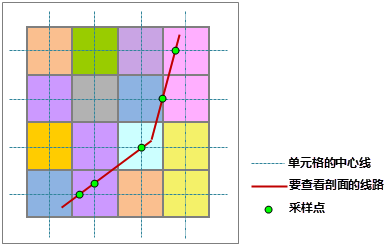
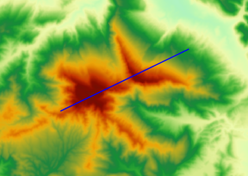
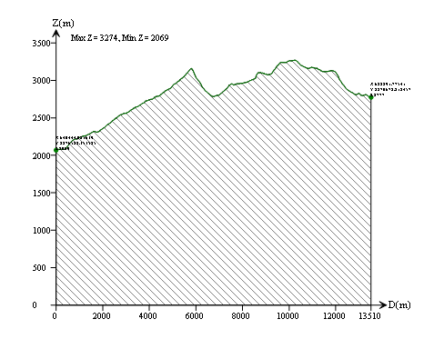
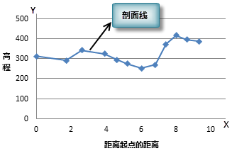

### 使用说明

剖面表示表面高程沿某条线（截面）的变化。研究某个截面的地形剖面，概括研究区域的地势、地质和水文特征，包括区域内的地貌形态、轮廓形状、绝对与相对高度、地质构造、斜坡特征、地表切割强度和侵蚀因素等，非常有利于修筑道路的难度评定或对沿指定路线铺设铁路线的可行性评估，也可作为计算土方量的依据。

如下图所示，对左图中的栅格表面进行剖面分析，得到的剖面线和剖面图如右图所示。

SuperMap 应用程序提供的剖面分析功能用来根据给定的线路查看栅格表面沿该线路的剖面，并得到剖面线和剖面采样点集合。

**采样点**

栅格表面是连续的，但要连续地表达出给定路线上的所有位置不太可能，因此需要沿这条线选取一些特征点，称为采样点。通过这些样点所在位置的高程和坐标信息，来展现剖面效果。如下图所示，取给定的线路与栅格像元的中心线相交的位置作为采样点。

  
---  
  
**剖面线和剖面采样点坐标集合**

剖面线是剖面分析的结果之一，它是一条折线。线上的节点与采样点一一对应，节点的 X 值（剖面图中 D
轴）表示当前采样点到给定路线的起点（即第一个采样点）的直线距离，默认单位为米，Y 值（剖面图中的 Z
轴）为当前采样点位置的高程数值。在坐标系中，左上方标注了剖面线上所有节点高程值的最小值和最大值，同时在剖面线上标注了指定的折线上（截面）节点的 X、Y
坐标和高程值。由此可知，剖面采样点集合给出了所有采样点的位置，而剖面线用来存储这些点。结合剖面线和剖面采样点集合可以确定某位置的高程以及距离指定的线路起点的距离。

 |   
---|---  
图：DEM 和路线 | 图：剖面线和剖面采样点数据集  
  
下图展示了二维坐标系下的剖面线示意图，通过剖面线可以直观的了解沿给定线路上地形的高程起伏情况。

  

### 操作步骤

  1. 在“ **空间分析** ”选项卡上的“ **栅格分析** ”组中，单击“ **表面分析** ”下拉按钮按钮，在弹出的下拉菜单中选择“ **剖面分析** ”项，弹出“剖面分析”对话框。
  2. 设置剖面分析的源数据，选择要进行剖面分析的栅格数据所在的数据源，以及栅格数据集。
  3. 设置路线数据。选择路线数据所在的数据源，以及线数据集。对一条线对象生成一个剖面线数据和采样点数据；如果线数据中存在多个线对象，则会生成多个剖面数据和采样点数据，
  4. 设置结果数据。选择生成的剖面线（CAD 数据集）要保存的数据源，以及剖面线数据的名称。
  5. 设置是否生成剖面采样点数据集。勾选"创建剖面采样点数据集"复选框，则在生成剖面线的同时，会自动创建剖面采样点数据集；否则不会创建剖面采样点数据集。
  6. 以上参数设置完成后，单击"确定"按钮，执行操作；或者单击"取消"按钮，放弃当前操作。
  7. 执行成功后，在“工作空间管理器”中双击结果CAD数据集，即可查看剖面线结果信息。

  