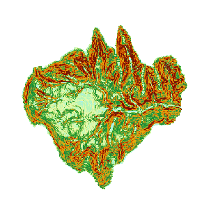

###  使用说明

坡度分析用于计算栅格数据集（通常使用 DEM 数据）中各个像元的坡度值。坡度值越大，地势越陡峭；坡度值越小，地势越平坦。

DEM 数据中的像元值即该点的高程值，通过高程值计算该点的坡度。由于计算点的坡度没有实际意义，在 SuperMap 中，坡度计算的是各像元平面的平均值，并且提供了三种坡度表现形式：度数、弧度、百分比。关于坡度分析的原理和计算方法，请参见 **关于表面分析**
的[坡度和坡向](AoubtSurfaceAnalyst)部分。

**注** ：地理坐标系数据无法直接进行坡度分析，请先将数据转换为投影坐标系后再进行坡度分析。

**应用实例**

打开“ExerciseData/RasterAnalysis”文件夹下的“Terrain”数据源，其中有分辨率为5米的 DEM 数据，我们用此数据来做示例。

###  功能入口

  * 在 **空间分析** 选项卡-> **栅格分析** -> **表面分析** -> **坡度分析** ；
  * **工具箱** -> **栅格分析** 工具-> **表面分析** -> **地形计算** -> **坡度分析** 。(iDesktopX)

###  主要参数

  * 源数据
    * **数据源** ：列出了当前工作空间中所有的数据源，选择需要进行坡度分析的数据集所在的数据源。
    * **数据集** ：列出了当前数据源中所有的栅格数据集（GRID）。在列表中选择需要进行坡度分析的数据集，通常我们会选择拥有高程值的 DEM 数据。这里会自动定位到工作空间管理器内选中的数据集。
  * 参数设置
    * **坡度单位类型** ：选择所要使用的坡度分析单位，包括角度、弧度和百分比三种类型，用户可根据需要选择合适的类型进行坡度分析。
    * **高程缩放比例** ：用来设置高程被拉伸的程度。数值越大表示拉伸越大，地形越夸张。当系数为1表示不拉伸。数值单位为倍，即对高程相对于原始高度拉伸的倍数。
  * 结果设置
    * **数据源** ：列出了当前工作空间中所有的数据源，选择结果数据集所在的数据源。默认与源数据源相同。
    * **数据集** ：设置结果数据集的名称。新生成的坡度数据集是一个和源数据集等大且分辨率相同的数据集。
  * 执行坡度分析操作，得到如下结果。

  

###  相关主题

 [关于表面分析](AoubtSurfaceAnalyst)

