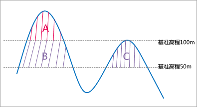

### 使用说明

“表面体积”功能用来计算栅格表面体积，即计算所选多边形区域内的栅格数据集拟合的三维曲面与一个基准平面之间的空间上的体积。

计算表面体积，需指定 **基准高程**
，基准高程是作为基准水平面的高程值，是量算体积高度的起算基准面。如下图所示，当基准高程给定为50米，量算后的体积包含基准平面上与栅格围合的区域 A，B，C
三个区域体积，即：体积=A+B+C；当基准高程给定为100米，量算后的体积是A区域的体积。

  

### 操作步骤

**地表体积**

1. 在地图窗口中打开要计算表面体积的栅格数据集。注意：当前工作空间中，如果不存在打开的栅格数据时，该功能不能使用。
2. 在“ **空间分析** ”选项卡的“ **栅格分析** ”组中，单击“ **表面分析** ”下拉按钮，在弹出的下拉菜单中选择“ **地表体积** ”子项，此时输出窗口中提示：“请用鼠标在地图上画一个多边形，然后单击右键进行分析。”。
3. 在地图上画一个多边形，单击鼠标右键，此时弹出“表面体积参数设置”对话框。在对话框中输入基准高程。程序默认给定的基准高程是指定区域的最小高程。当用户指定的基准高程值大于当前量算范围的最大高程时，程序会给出超限提示和值域范围。
4. 单击“计算”按钮，计算临时绘制的多边形覆盖的体积。输出窗口即会提示设置的基准高程及分析区域的体积，默认的体积单位为立方米。默认的体积单位为立方米。按住 Esc 键可以清除地图窗口中绘制的临时多边形对象。

**选中多边形对象量算**

1. 在" **空间分析** "选项卡的" **栅格分析** "组中，单击" **表面分析** "下拉按钮，在弹出的下拉菜单中选择“ **选面体积** ”子项，地图中会弹出提示"选择一个或多个面对象来进行表面量算，单击右键结束选择"。 

或用户在地图窗口中先选中一个或者多个多边形对象（按住 Shift 键可以选择多个多边形对象），再单击“ **选面体积**
”子项，则直接弹出“表面体积参数设置”对话框。

2. 弹出"表面体积参数设置"对话框，在对话框中输入基准高程。程序默认给定的基准高程是指定区域的最小高程。当用户指定的基准高程值大于当前量算范围的最大高程时，程序会给出超限提示和值域范围。
3. 单击"计算"按钮，计算选中多边形覆盖的体积。输出窗口即会提示设置的基准高程及分析区域的体积，默认的体积单位为立方米。默认的体积单位为立方米。

注：当选中多个多边形对象时，量算结果为多个多边形对象的表面体积之和。默认体积的单位为立方米。按住 Esc 键可以清除地图窗口中多边形对象的选中状态。

