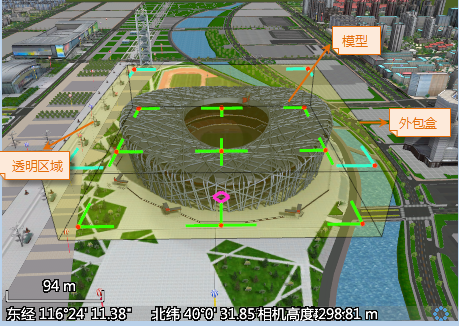
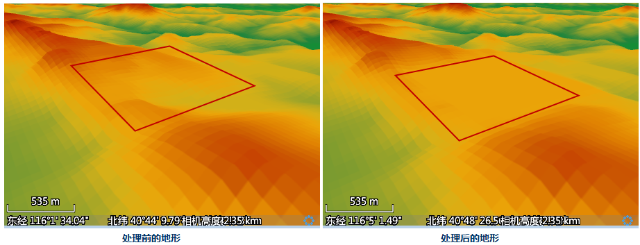
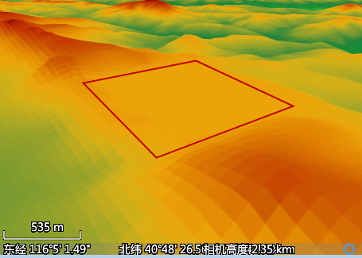

### 使用说明

* 由于 CAD 模型包围盒的底面是一个矩形，与模型实际覆盖范围不一致，包含了一些透明区域。如图1所示，在三维场景中选中一个 CAD 模型，模型的包围盒所覆盖的地形范围比模型实际覆盖范围要大。在进行地形模型匹配时，将会按照模型的包围盒的范围对地形进行匹配处理，因此可能会导致地形处理不理想。因此应尽量选择模型的包围盒与模型实际范围一致的 CAD 模型数据，或者将模型底部区域绘制为矢量面进行模型匹配。
* 当地形数据使用的是地理坐标系时，应用程序会将经纬度粗略换算到米，从而可能会影响处理的精度。因此，建议用户使用具有投影坐标系的地形栅格数据进行匹配，然后对生成的结果进行投影转换，方便在场景中查看。  

  

* 当输入的模型数据中的 CAD 模型或者面对象出现相交时，地形模型匹配的结果可能不正确。所以最好使用没有相交对象的数据进行地形模型匹配。

### 使用说明

1. 单击功能区 > “ **空间分析** ”选项卡 > “ **栅格分析** ”组的 **“DEM构建”** 下拉按钮，在弹出的下拉菜单中选择“ **地形匹配** ”命令，弹出“地形模型匹配”对话框。 
2. 设置要进行地形匹配的地形数据。 
* **数据源** ：列出了当前工作空间中所有的数据源，选择要匹配的地形数据集所在的数据源。
* **数据集** ：列出了当前数据源中所有的栅格数据集（GRID），在列表中选择要操作的栅格数据集。这里会自动定位到工作空间管理器内选中的地形数据集。
3. 设置参与匹配的模型数据。 
* **数据源** ：列出了当前工作空间中所有的数据源，选择要匹配的地形数据集所在的数据源。
* **数据集** ：列出了当前数据源中所有的 CAD 数据集和面数据集。
4. 设置高程字段。当参考数据集为面数据集时，需要指定要使用的高程字段，以此为参考对地形数据进行处理。 当参考数据集为 CAD 模型数据集时，高程字段项为不可用状态。
5. 设置平滑过滤参数。 
* **过渡区域半径** ：需要进行平滑处理区域的半径，该区域范围是以模型对应地形的外边界为起点，以过渡区域半径为缓冲半径得到的范围。单位为米。
* **平滑系数** ：光滑系数直接决定了平滑处理的效果。取值在[0,3]范围内时过渡效果较为理想。当平滑系数为0时表示不对模型周围的过渡区域进行平滑处理。默认为2。
6. 设置结果数据。 
* **数据源** ：列出了当前工作空间中所有的数据源，选择结果数据集所在的数据源。
* **数据集** ：输入结果数据集的名称。
7. 单击“确定”按钮，执行地形模型匹配操作。

图3和图4展示了地形模型匹配前后地形上过渡区域的三维显示效果。

 |   
---|---  
图3：处理前的地形 | 图4：处理后的地形  

###  相关主题

 [地形模型匹配概述](AboutTerrainMatch.htm)

