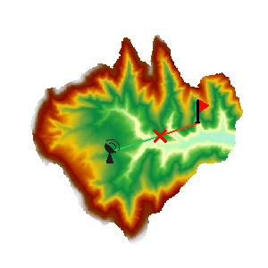

###  使用说明

根据给定的观察点和被观察点，在输入的栅格表面上对这两个点之间能否相互通视进行分析。

  * 当前地图窗口中必须存在 Grid/DEM 数据集时，才可以使用通视分析功能。
  * 附加高程值作为观测点的总高程组成部分之一，对通视分析结果有重要影响，因此需要了解观察点的表面高程值以及附加高程值，以保证分析结果更符合实际情况。

**应用实例**

打开“ExerciseData/RasterAnalysis”文件夹下的“Terrain”数据源，其中有分辨率为5米的 DEM 数据，我们用此数据来做示例。

###  功能入口

  * 在 **空间分析** 选项卡-> **栅格分析** -> **表面分析** -> **两点可视性** ；

###  操作说明

  * 指定观察点。在地图窗口中绘制一条线段，线段端点分别为可视性分析的两点。绘制结束后绘制的线段在地图窗口中高亮显示。 
  * 弹出“两点可视性分析”对话框。对话框中显示了观察点与被观察点的坐标信息，如果设置观测点的附加高程值，在对话框中输入即可。
  * 单击“确定”按钮，进行两点可视性分析操作。 

  

两点可视性分析完成后，地图窗口和输出窗口中会显示分析结果。在地图窗口中，红色的线表示不通视，绿色的线表示通视。在输出窗口中会给出可视性分析结果，通视或者不通视；如果不通视会给出第一个阻视点的坐标以及建议修改的高程值。

###  相关主题

[关于表面分析](AoubtSurfaceAnalyst)
