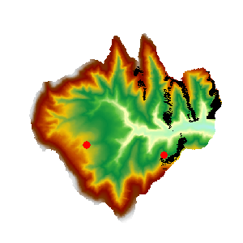

### 使用说明

可视域分析是在栅格数据的表面，对于一个或者多个观察点，基于一定的相对高度，提取给定长度范围和方向范围内所能看到的区域，并将分析结果输出为一个栅格数据集。

  * 附加高程值作为观察点的总高程组成部分之一，对可视域的分析结果有重要影响，因此需要了解观察点的表面高程值以及附加高程值，以保证分析结果更符合实际情况。
  * 观测半径默认值为0，表示在整个分析区域内进行查找，观测半径的单位与参与分析的栅格数据集保持一致。
  * 当有多个观察点时，可视域的分析结果可以是所有观察点的可视区域的并集或者交集。当使用“共同可视域”参数时，表示取所有观察点的可视区域的交集，否则取所有观察点的可视区域的并集。

**应用实例**

打开“ExerciseData/RasterAnalysis”文件夹下的“Terrain”数据源，其中有分辨率为5米的 DEM 数据，我们用此数据来做示例。

### 功能入口

  * 在 **空间分析** 选项卡-> **栅格分析** -> **表面分析** -> **可视域** ；
  * **工具箱** -> **栅格分析** 工具-> **表面分析** -> **可视域** -> **可视域** 。(iDesktopX)

### 主要参数

  * 指定观察点。可以通过鼠标单击的方式添加，也可以直接导入点数据集作为观察点。在“可视性分析”对话框中，单击“鼠标点击加点”按钮，鼠标状态变为添加状态，即可在栅格表面单击鼠标选取观察点。选定的观察点会在地图上用蓝色高亮标识。

或者在工具条中使用导入功能导入观察点。对话框上方的工具条提供了“鼠标单击加点”按钮、“全选”按钮、“反选”按钮、“删除”按钮、“导入”按钮、“导出”按钮和“统一设置”按钮。

    * “导入”按钮：用来导入点数据集中点导入，作为观察点和被观察点进行分析。此数据集中必须包含附加高程字段、观测半径、起始角度和观测角度等字段。单击“导入”按钮，弹出“导入点数据集”对话框，在该对话框中设置要导入的数据集，附加高程值、观测半径、起始角度、观测角度等对应的字段、以及过滤表达式等。 
    * “导出”按钮：将当前地图窗口中添加的点导出为点数据集，并将附加高程信息、观测半径、起始角度和观测角度等信息保存在属性表中。单击“导出”按钮，弹出“导出点数据集”对话框，在该对话框中设置导出的点数据集的信息，包括数据集的名称、附加高程字段名称、观测半径字段、观测角度字段等的名称，如下图所示。
    * “设置”按钮：当在对话框中选中了一条或多条记录后，单击该按钮，弹出“批量参数设置”对话框，统一设置选中的记录参数信息，包括：附加高程值、观测半径、起始角度和观察角度等。
  * 可视域分析参数设置，包括附加高程、观测半径、起始角度和观察角度。

**附加高程：** 观察点高出栅格表面的相对高度。比如在地图上选择的点的高程为430米，附加高程值为100米，则分析点的高程为530米。默认值为0。

**观测半径：** 用来设置可视域分析时的长度范围。可视域为以观察点为圆心，此数值为半径的圆形区域。系统默认0，表示使用栅格表面数据集的最大范围。

**起始角度和观察角度：**
用来设置可视域分析的方向范围。起始角度为0度，表示从正北方向开始，按照顺时针方向搜索，达到最大观察角度时停止。默认最大观察角度为360度。

  * 其他分析参数设置，包括分析结果、共同视域以及是否将结果数据集添加到当前地图窗口等。

**数据源：** 列出了当前工作空间中的数据源。需要选择分析结果要保存的数据源。

**数据集：** 设置结果保存的数据集。需要输入结果保存的数据集名称。

**共同可视域：** 当有多个观察点时，需要设置可视域的为各个观察点的并集还是交集。勾选“共同可视域”表示分析结果取所有观察点的交集，否则取并集。

**将结果数据集添加到当前地图窗口中：** 选中此项，表示分析完成后，结果数据集会自动添加到当前地图窗口，否则不会自动添加。

**执行完成后自动关闭对话框：** 选中此项，表示分析完成后自动关闭可视域分析对话框，否则不会关闭。

  * 完成可视域分析操作，结果图示如下：
  
---  
图：可视域分析结果

###  相关主题

 [关于表面分析](AoubtSurfaceAnalyst.html)

* * *

|

  
  
---

