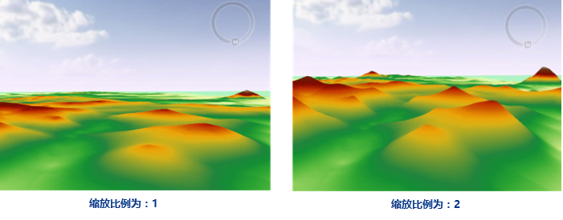

### 源数据

- **数据源：** 选择要进行插值的数据集所在的数据源。

- **数据集：** 选择要进行插值的数据集。系统根据插值的数据类型，自动过滤选中的数据源下的数据集，只显示该数据源下的点数据集。

- **插值字段：**选择要进行插值的相关字段，自动过滤为数值型字段。如果本次插值是为了预测高程，则该字段为一个高程字段；如果本次插值是为了预测降水量，则该字段为一个降水相关字段；如果本次插值是为了预测噪音等级，则该字段为一个噪音分贝字段。因此在进行分析前，选择的点数据集要有相关字段才可以进行分析。

- **缩放比例：**
插值字段值的缩放比率，将源数据的插值字段值乘缩放比例再进行插值，可对进行插值分析的值进行缩放。如下图所示，左图缩放比例为1，右图缩放比例设置为2，插值后同位置处的栅格值是左图的2倍左右。

  

### 结果数据

- **数据源：** 选择样条插值分析结果要保存的数据源。

- **数据集：** 输入插值分析结果要保存的数据集名称。如果输入的数据集名称已经存在，则会提示数据集名称非法，需要重新输入。

- **分辨率：** 输入插值分析结果的分辨率，即单个像元所对应的地面面积大小，单位与数据集单位一致。可以直接输入分辨率，然后系统会根据输入的分辨率自动计算行列数。

- **像素格式：** 插值数据集像素的存储格式，包括1位无符号、16位、32位、单精度浮点型、双精度浮点型。用户可根据实际需求选择合适的像素格式，像素格式的具体说明请参见[栅格数据集像素格式](../../VectorRasterConvert/PixelFormat)。

- **列数：** 表示经由网格范围和单元高度（或单元纬差）计算得出的网格的列数。

- **行数：** 表示经由网格范围和单元宽（或单元格经差）计算得出的网格的行数。

### 插值范围

插值范围默认为数据集范围，SuperMap提供了以下三种设置方式：

* **数据集范围** ：单击选中“数据集范围”单选框，即将数据集范围设置为分析范围。
* 右侧下拉按钮提供了以下两种方式： 
    * **选择对象** ：是指在当前地图窗口中通过鼠标框选或点选方式，选中一个或多个对象，将选中对象范围设置为输出范围；“
    * **绘制范围** ：是指在当前地图窗口中，通过单击鼠标绘制，确定一个矩形区域为输出范围；
* **复制粘贴** ：单击“ **复制** ”按钮可复制当前设置的范围，在支持粘贴的范围设置处单击“ **粘贴** ”按钮，即可将复制范围的左、下、右、上值设置到当前范围。

### 环境设置
* 单击“ **环境设置** ”按钮，设置分析环境参数，插值分析支持设置的分析环境参数包括结果数据集的地理范围、裁剪范围、默认输出分辨率等，具体描述请参见[设置分析环境](../../Raster/AnalystEnvironment)页面。 

注意：支持将环境参数设置为全局变量，即将此处设置的参数值作为总栅格环境分析环境参数，其他支持环境参数设置的功能，无需再重复设置。如果在此处不设置环境参数，则分析时读取栅格分析环境中该参数的设置。
