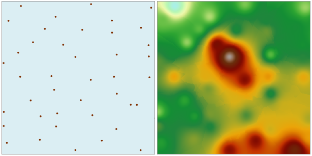

### 使用说明

距离反比权重插值基于插值区域内部样本点的相似性，计算与到邻近区域样点的加权平均值来估算出单元格的值，进而插值得到一个表面。

  * 用于插值的源数据集中必须有个数值型字段，作为插值字段。
  * 距离反比权重插值法是一种比较精确的插值方法，适用呈均匀分布且密集程度能够反映局部差异的样点数据集。
  * 距离反比权重插值使用样点间的加权平均距离，平均值不可能大于输入的最大值或小于输入最小值，因此生成的结果数据中，每一栅格值均处于采样数据的最大值与最小值范围之内。
  * 如果已知的观测点数据中不包含有某个局部地区的最大值（比如某一山峰的峰值）时，在该出现最大值的地方，获得的插值会低于附近周围其他点的值，可能与实际情况不符。因此要求样点数据集中最好包含插值区域的最大值和最小值采样点。

### 操作步骤

  1. 打开“ExerciseData/RasterAnalysis”文件夹下的“Precipitation”数据源，其中有部分地区气象监测站点的降水量数据，我们用此数据来做示例。
  2. 在“ **空间分析** ”选项卡上的“ **栅格分析** ”组中，单击“ **插值分析** ”按钮，进入栅格插值分析向导。
  3. 在“栅格插值分析”对话框中，选择 **距离反比权重** 插值方法，进入距离反比权重插值的第一步，需要设置相关参数。
  4. 设置插值分析的公共参数，包括源数据、插值范围、结果数据和环境设置。源数据、插值范围和结果数据等公共参数的设置请参见：[公共参数说明](CommonPara.htm)。
  5. 单击“下一步”，进入插值分析的第二步，在这一步中，需要设置样本点查找方式和其他参数（幂次）。

  6. 设置样本点查找方式。支持变长查找和定长查找两种方式。关于这两种查找方式的详细介绍请参见：[距离反比权重插值](aboutinterpolation.htm)。

变长查找

    1. 在“查找方式”右侧的单选框中，选择“变长查找”项，表示使用最大半径范围内的固定数目的样点值进行插值。
    2. 在“最大半径”右侧的文本框中，输入用于变长查找的半径大小。默认值为0，表示使用最大半径查找。
    3. 在“查找点数”右侧的文本框中，输入用于变长查找的点数目。默认点数为12。

定长查找

    1. 在“查找方式”右侧的单选框中，选择“定长查找”项，查找半径范围内所有的点都要参与插值运算。
    2. 在“查找半径”右侧的文本框中，输入设定查找半径大小。默认查找半径为参与插值分析的数据集的范围的长或者宽的较大值的1/5。所有该半径范围内的采样点都要参加插值运算。
    3. 在“最小点数”右侧的文本框中，输入用于变长查找的最少数目点。默认点数为5。当邻域中的点数小于所指定的最小值时，查找半径将不断增大，直到可以包含输入的最小点数为止。最大值为12。

  7. 设置幂次。幂次是权重距离的指数，控制插值时周围点的权重。可以是大于0的正整数值。默认值为2。
  8. 单击“完成”按钮，执行距离反比权重插值功能，如下图所示为距离反比权重插值结果。
  
     

