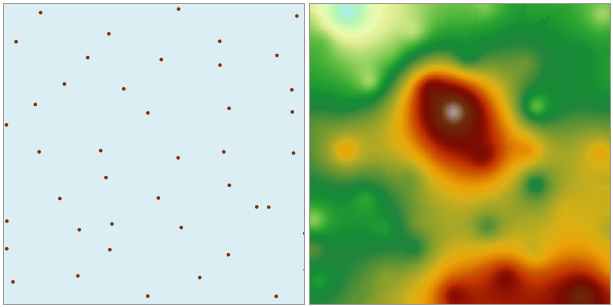

### 使用说明

样条插值法利用最小表面曲率的数学表达式来，模拟生成通过一系列样点的光滑曲面。

* 用于插值的源数据集中必须有个数值型字段，作为插值字段。
* 样条插值法适用对大量样点进行插值计算，同时要求获得平滑表面的情况。用于插值的输入点越多，生成的表面也就越平滑。同时如果点数的值越大，处理输出栅格所需的时间就越长。
* 定长样条函数方法使用可能位于样本数据范围之外的值来创建渐变的平滑表面。变长样条函数方法根据建模现象的特性来控制表面的硬度。它使用受样本数据范围约束更为严格的值来创建不太平滑的表面。

### 操作步骤

1. 在“ **空间分析** ”选项卡上的“ **栅格分析** ”组中，单击“ **插值分析** ”按钮，进入栅格插值分析向导。
2. 在“栅格插值分析”对话框中，选择 **样条** 插值方法，进入样条插值的第一步，需要设置相关参数。
3. 设置插值分析的公共参数，包括源数据、插值范围、结果数据和环境设置。源数据、插值范围和结果数据等公共参数的设置请参见：[公共参数说明](CommonPara.htm)。
4. 单击“下一步”，进入插值分析的第二步，设置样本点查找方式和其他参数。

5. 设置样本点查找方式。支持变长查找、定长查找和块查找三种方式。关于这三种查找方式的详细介绍请参见：[样条插值](aboutinterpolation.htm)。

变长查找

  1. 在“查找方式”右侧的单选框中，选择“变长查找”项，表示使用最大半径范围内的固定数目的样点值进行插值。
  2. 在“最大半径”右侧的文本框中，输入用于变长查找的半径大小。默认值0，表示使用最大查找半径。
  3. 在“查找点数”右侧的文本框中，输入用于变长查找的点数目。默认点数为12。

定长查找

  1. 在“查找方式”右侧的单选框中，选择“定长查找”项，查找半径范围内所有的点都要参与插值运算。
  2. 在“查找半径”右侧的文本框中，输入设定查找半径大小，所有该半径范围内的采样点都要参加插值运算。默认查找半径为点数据集的区域范围对应的矩形对角线的长度。
  3. 在“最小点数”右侧的文本框中，输入用于变长查找的最少数目点。默认查找半径为参与插值分析的数据集的范围的长或者宽的较大值的1/5。当邻域中的点数小于所指定的最小值时，查找半径将不断增大，直到可以包含输入的最小点数为止。最小点数的取值范围为[0,12]，默认值为5。

块查找

  1. 在“查找方式”右侧的单选框中，选择“块查找”项，根据设置的“块内最多点数”对数据集进行分块，然后使用块内的点进行插值运算。 
  2. 在“最多参与插值点数”右侧的文本框中，输入最多参与插值点数。默认最多参与插值的点数为20。为了避免在插值时出现裂缝区，实际计算使用的插值块会在每个分块区域的基础上再均匀向外扩张，“最多参与插值点数”决定了块区域向外扩张的大小。一般此数值应大于设置的“块内最多点数”。
  3. 在“块内最多点数”右侧的文本框中，输入每个块内的点的最多数量。默认单个块内最多点数为5。若块内点数多于此值，则继续分块；否则停止分块。

“最多参与插值点数”与“块内最多点数”的参数的设置会直接影响快查找的性能。这两个值设置的越大，查找花费的时间会越久，因此建议用户在设置快查找的参数时设置比较合理的参数。

6. 在“张力系数”右侧的文本框中，输入张力系数值，默认为40。张力系数是用来调整结果栅格数据表面的特性，张力越大，插值时每个点对计算结果影响越小，反之越大。
7. 在“光滑系数”右侧的文本框中，输入光滑系数值，值域为0-1，默认为 0.1。光滑系数是指插值函数曲线与点的逼近程度，此数值越大，函数曲线与点的偏差越大，反之越小。
8. 单击“完成”按钮，执行样条插值功能，如下图所示为样条插值结果。  

  
