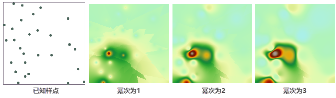
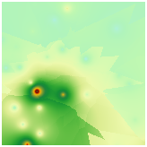
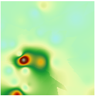
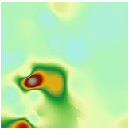
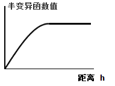
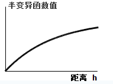
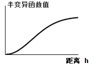
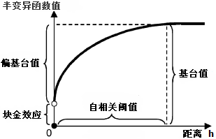

插值是利用已知的样点去预测或者估计未知样点的数值。内插是通过已知点的数据推求同一区域未知点的数据。外推是通过已知区域，推求其他区域的数据。无论是内插的方法还是外推的方法，都是插值过程常用的插值思想。SuperMap
中提供三种插值方法，用于模拟或者创建一个表面，分别是：距离反比权重法（IDW）、克吕金插值方法（Kriging）、径向基函数插值法（RBF）。选用何种方法进行内插，通常取决于样点数据的分布和要创建表面的类型。无论选择哪种插值方法，已知点的数据越多，分布越广，插值结果将越接近实际情况。

[### 距离反比权重插值](IDWinterpolation.htm)

距离反比权重插值（Inverse Distance Weighted，简称
IDW）基于样点相近相似的原理。假设两个样点距离越近，则它们的性质越相似，反之，距离越远则相似性越小。它通过计算与到附近区域样点的加权平均值来估算出单元格的值，距离样点中心越近则权重值越大。这是一种简单有效的数据内插方法，运算速度相对较快。

除了权重距离，幂次以及查找半径也是 IDW 插值的重要影响因子。

* **幂次：** 幂次与权重距离的计算有关，幂指数对 IDW 的插值结果有很大影响。幂次值越低，插值结果越平滑；幂次值越高，插值结果细节越详细。默认幂次为2。
* 查找半径：距离反比权重插值的查找半径类型有两种，分别是：
* **变长查找：** 距离栅格单元最近的指定数目的采样点参与内插计算。对于每个栅格单元，参与内插运算的采样点数目是固定的，而用于查找的半径是变化的，查找半径取决于栅格单元周围采样点的密度。如果采样点超出最大查找范围，该部分采样点将不参与插值运算；
* **定长查找:** 指定半径范围内所有的采样点都参与栅格单元的插值运算。如果在指定半径范围内参与内插运算的采样点个数小于指定的最小数目，将扩大查找半径，以包含更多的采样点，保证参与计算的采样点数目达到指定的最小数目。

下图为采用距离反比权重插值法，插值字段为高程，分辨率为100，查找半径类型为变长查找，点数为所有点，幂次分别1、2、3的表面插值效果。

 |  |  |  
---|---|---|---  
图：已知样点 | 图：幂次为1 | 图：幂次为2 | 图：幂次为3    

[### 样条插值](Splineinterpolation.htm)

样条函数是模仿手工样条，经过一系列样本点绘制光滑曲线的数学方法。样条插值是一种比较精确的插值技术，假设变化是平滑的，它有两个特点：（1）表面必须精确通过所有样本点；（2）表面必须具有最小曲率。样条插值在创建有视觉要求的曲线和等高线方面有优势。

样条插值法适用于对大量样点进行插值计算，同时要求获得平滑表面的情况。在表面变化平缓的情况下，会得到比较理想的结果。而如果在较短的水平距离内表面值发生急剧变化时，或者当获取的样点数据不够准确时，此方法不适用。

样条插值的查找半径类型有三种，分别是：

* **变长查找：** 距离栅格单元最近的指定数目的采样点参与内插计算。对于每个栅格单元，参与内插运算的采样点数目是固定的，而用于查找的半径是变化的，查找半径取决于栅格单元周围采样点的密度。如果采样点超出最大查找范围，该部分采样点将不参与插值运算。
* **定长查找：** 指定半径范围内所有的采样点都参与栅格单元的插值运算。如果在指定半径范围内参与内插运算的采样点个数小于指定的最小数目，将扩大查找半径，以包含更多的采样点，保证参与计算的采样点数目达到指定的最小数目。
* **块查找：** 根据设置的每个块内的点的最多数量对数据集进行分块，使用块内的点进行插值运算。

### 克吕金插值

克吕金插值法以数据的空间自相关性为基础，使用变异函数模型，对有限区域内的未知样本点进行无偏估计的插值方法。在样本点存在空间自相关性或者方向性趋势时，克吕金是最合适的插值方法。同一个分布区内的样点数据之间存在的相互依赖性，即空间自相关性。并且距离越近的两个样点之间，相关性越强。目前克吕金插值方法被广泛的应用于土壤学和地质学中。

* **半变异函数模型**

SuperMap 支持球函数、指数函数和高斯函数三种半变异函数。

* 球函数类型显示了空间自相关关系逐渐减少的情况下（即半变异函数值逐渐增加），直到超出一定的距离，空间自相关关系为0。球型函数较为常用。
  

* 指数函数用于在空间自相关关系随距离增加成指数递减的情况。指数函数模型使用较多。  
  

* 高斯函数类型适用于半变异函数值渐近地逼近基台值的情况。
  

* **参数描述**

半变异函数模型表征了采样点的空间自相关情况。通过自相关阈值、基台值和块金效应对半变异函数模型进行描述。

* **自相关阈值：** 半变异函数值在达到一定的距离（X 轴）以后会趋于一个定值。这段距离就是自相关阈值的范围。在自相关阈值范围之内，样本点数据具有相关性；而在自相关阈值之外，样本点数据之间互不相关，即在自相关阈值以外的样本点不对估计结果产生影响。
* **基台值：** 半变异函数所达到的顶点值（Y 轴）。基台值减去块金效应就是偏基台值。如下图所示：  

  
* **块金效应：** 在h=0时，半变异函数与 Y 轴相交的值，在地质统计学中称为“块金效应”，表现为在很短的距离内有较大的空间变异性。它可以由测量误差引起，也可以来自矿化现象的微观变异性。

SuperMap 提供三种克吕金插值方法，分别是普通克吕金、简单克吕金和泛克吕金。

* **[普通克吕金](OrdinaryKriging.htm)**：是区域化变量的线性估计，假设观测数据呈正态分布，并且认为区域化变量的期望值是未知的。
* **[简单克吕金](SimpleKriging.htm)**：是区域化变量的线性估计，假设观测数据呈正态分布，并且认为区域化变量的期望值是固定的常数。
* **[泛克吕金](UniversalKriging.htm)**：当观测数据中存在某种趋势时，且该趋势可以用一个确定的函数或者多项式来拟合，可以使用泛克吕金插值法。

不同的插值方法有其适用的条件。因此在对数据进行插值时，需要根据数据的特点，选择合适插值方法，保证得到最理想的插值效果。下表对五种插值方法从以下四个方面进行了对比，具体如下：

方法 | 外推能力 | 逼近程度 | 运算能力 | 适用范围  
---|---|---|---|---  
距离反比权重 | 分布均匀时，较好 | 差 | 快 | 分布均匀  
样条 | 高 | 强 | 快 | 分布密集时  
普通克吕金 | 高 | 强 | 较慢 | 均可  
简单克吕金 | 高 | 强 | 较慢 | 均可  
泛克吕金 | 高 | 强 | 较慢 | 均可  

### 相关主题

[距离反比权重插值](IDWinterpolation.htm)

[样条插值](Splineinterpolation.htm)

[普通克吕金插值](OrdinaryKriging.htm)

[简单克吕金插值](SimpleKriging.htm)

[泛克吕金插值](UniversalKriging.htm)

