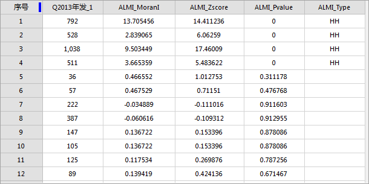
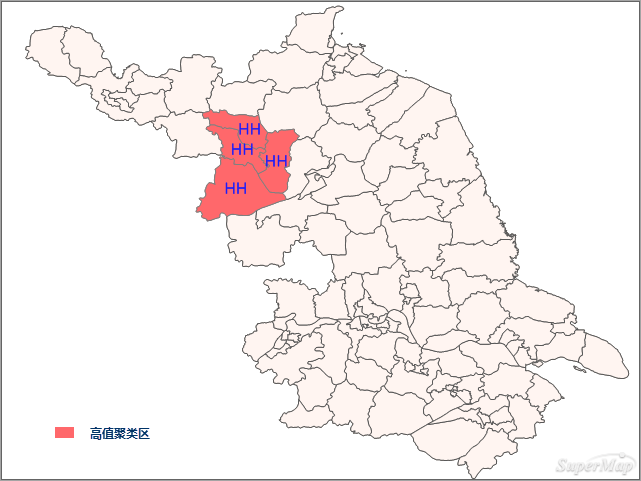

聚类和异常值分析可识别具有拥挤显著性的热点、冷点、空间异常值，使用 Anselin Local Moran‘s I（局部莫兰指数）
统计量，对加权要素进行分析。

散点图是数据分析中用来表示二个变量之间相关关系的一种常见的方法。表示一个变量的空间自相关关系，可以采用 Moran 散点图。

### Moran 散点图

Moran 散点图可以用来探索空间关联的全局模式、识别空间异常和局部不平稳性等。将变量在每个位置上的观测值表示在横轴上，其空间滞后（标准化的局部空间自相关指标Moran’s I）表示在纵轴上，则二者之间的相关关系就可以用坐标系中的散点形象地表现出来。

Moran散点图分为四个象限，分别对应四种不同类型的局部空间关联模式：

  * 右上象限（H-H）：观测值zi大于均值（high），其空间滞后也大于均值（high）。
  * 左下象限（L-L）：观测值zi小于均值（low），其空间滞后也小于均值（low）。
  * 左上象限（L-H）：观测值zi小于均值（low），但其空间滞后大于均值（high）。
  * 右下象限（H-L）：观测值zi大于均值（high），但其空间滞后小于均值（low）。

不同象限所表示的空间关系含义：

  * 右上象限（H-H）和左下象限（L-L）对应正的空间自相关，表示该位置上的观测值和周围邻居的观测值之间相似。其中，右上象限（H-H）对应高-高相似，左下象限（L-L）对应低-低相似。
  * 左上象限（L-H）和右下象限（H-L）对应负的空间自相关，表示该位置上的观测值和周围邻居的观测值之间相异。其中，左上象限（L-H）对应低-高相异，右下象限（H-L）是高-低相异，即低值被周围的高值所围绕，和高值被周围的低值所围绕。
  * 右上和左下两个象限分别对应G统计量中的正的空间关联（高-高）和负的空间关联（低-低）。观察右上和左下两个象限的相对密度，可以了解全局空间关联模式在多大程度上是由高值还是低值之间的关联决定的。
  * 观察左上和右下两个象限的相对密度，可以了解哪种形式的负的空间关联占主导地位。
  * 此外，观察Moran散点图的左上和右下两个象限，还可以发现潜在的空间异常。以散点图的象限中心点为圆心，做一个半径为2的圆，可以认为圆以外的观测点是异常值。这是因为，Moran散点图是用标准化的变量和其空间滞后构造的，图上2个单位的距离意味着偏离均值两个标准差，可以看作是异常值。

当在Moran 散点地图中仅显示那些显著高或显著低的观测值时，得到 Moran 显著性地图。如果显著观测值属于散点图中的第一象限或第三象限，则认为存在显著空间聚集；如果属于第二或第四象限，则认为存在显著的空间差异。

### 应用案例

  * 研究区域中的富裕区和贫困区之间的最清晰边界在哪里？
  * 研究区域中异常消费模式的位置在哪里？
  * 研究区域中意想不到的糖尿病高发地在哪里？

###  功能入口

  * 在 **空间分析** 选项卡-> **空间统计分析** -> **聚类分布** -> **聚类和异常值分析** ；
  * **工具箱** -> **空间统计分析** 工具-> **聚类分布** -> **聚类和异常值分析** ；

###  主要参数

  * **源数据** ：设置待分析的矢量数据集，支持点、线、面三种类型的数据集。
  * **评估字段** ：设置分析要素参与分析的属性字段值，仅支持数值型字段。
  * **概念化模型** ：选择应反映要分析的要素之间的固有关系，设置要素在空间中彼此交互方式构建的模型越逼真，结果就越准确。 
    * 固定距离模型：适用于点数据、及面大小变化较大的面数据。
    * 面邻接模型(共边、相交)：适用于存在相邻边、相交的面数据。
    * 面邻接模型(邻接点、共边、相交)：适用于有邻接点、相邻边、相交的面数据。
    * 反距离模型：所有要素均被视为所有其他要素的相邻要素，所有要素都会影响目标要素，但是随着距离的增加，影响会越小，要素之间的权重为距离分之一，适用于连续数据。
    * 反距离平方模型：与"反距离模型"相似,随着距离的增加，影响下降的更快，要素之间的权重为距离的平方分之一。
    * K最邻近模型：距目标要素最近的K个要素包含在目标要素的计算中（权重为1）,其余的要素将会排除在目标要素计算之外（权重为0）。如果想要确保具有一个用于分析的最小相邻要素数，该选项非常有效。当数据的分布在研究区域上存在变化以致于某些要素远离其他所有要素时，该方法十分适用。当固定分析的比例不如固定相邻对象数目重要时，K 最近邻方法较适合。
    * 空间权重矩阵：需要提供空间权重矩阵文件，空间权重是反映数据集中每个要素和其他任何一个要素之间的距离、时间或其他成本的数字。如果要对城市服务的访问性进行建模，例如要查找城市犯罪集中的地区，借助网络对空间关系进行建模是一个好办法。分析之前使用生成网络空间权重工具创建一个空间权重矩阵文件 (.swmb)，然后指定提供所创建的 SWMB 文件的完整路径。
    * 无差别区域模型：该模型是"反距离模型"和"固定距离模型"的结合，会将每个要素视为其他各个要素的相邻要素，该选项不适合大型数据集，在指定的固定距离范围内的要素具有相等的权重（权重为1）；在指定的固定距离范围之外的要素,随着距离的增加，影响会越小。
  * **中断距离容限** ："-1"表示计算并应用默认距离，此默认值为保证每个要素至少有一个相邻的要素；"0"表示为未应用任何距离，则每个要素都是相邻要素。非零正值表示当要素间的距离小于此值时为相邻要素。
  * **反距离幂指数** ：控制距离值的重要性的指数，幂值越高，远处的影响会越小。
  * **相邻要素数目** ：设置一个正整数，表示目标要素周围最近的K个要素为相邻要素。
  * **距离计算方法** ：距离计算的方法采用欧氏距离和曼哈顿距离。有关欧式距离和曼哈顿距离的详细描述，请参看[空间统计分析基本词汇](BasicVocabulary)。
  * **空间权重矩阵标准化** ：当要素的分布由于采样设计或施加的聚合方案而可能偏离时，建议使用空间权重矩阵标准化。选择空间权重矩阵标准化后，每个权重都会除以行的和（所有相邻要素的权重和）。空间权重矩阵标准化的权重通常与固定距离相邻要素结合使用，并且几乎总是用于基于面邻接的相邻要素。这样可减少因为要素具有不同数量的相邻要素而产生的偏离。空间权重矩阵标准化将换算所有权重，使它们在 0 和 1 之间，从而创建相对（而不是绝对）权重方案。每当要处理表示行政边界的面要素时，您都可能会希望选择“空间权重矩阵标准化”选项。
  * **是否进行FDR校正** ：若进行FDR（错误发现率）校正，则统计显著性将以错误发现率校正为基础，否则，统计显著性将以P值和Z得分字段为基础。

### 结果输出

聚类和异常值分析的结果数据集中，将会包含四个属性字段：局部莫兰指数、z 得分和 p 值、聚类和异常值类型，分别为ALMI_MoranI 、ALMI_Zscore、ALMI_Pvalue 、ALMI_Type 四个字段。 字段含义解释如下：

由于聚类和异常值是基于置信度95%做的运算，因此只有P值小于0.05时，ALMI_Type字段中才具有值。如果应用错误发现率 (FDR) 校正，统计显著性将会以校正的置信度（将p 值阈值从 0.05 降低到某个新值）为基础, 以兼顾多重测试和空间依赖性。

P值(ALMI_Pvalue) | 莫兰指数(ALMI_MoranI) | 代表的含义 | 聚类和异常值类型(AIMI_TYPE)  
---|---|---|---  
P＜0.05 | M＞0 | 表示为高值或者低值聚类 | HH(高值聚类)或LL(低值聚类)  
P＜0.05 | M＜0 | 表示为异常值 | HL(低值围绕高值)或LH(高值围绕低值)  
  
P值(ALMI_Pvalue) | Z得分(ALMI_Zscore) | 代表的含义 | 聚类和异常值类型(AIMI_TYPE)  
---|---|---|---  
P＜0.05 | Z＞0 | 表示周围的要素拥有相似值（高值或低值）。 | HH(高值聚类)或LL(低值聚类)  
P＜0.05 | Z＜0 | 表示有一个具有统计显著性的空间数据异常值。 | HL(低值围绕高值)或LH(高值围绕低值)  
  
**实例**
：对病毒性肝炎县区数据的2013年发病数进行聚类和异常值析分析，设置评估字段为2013年发病数，概念化模式为反距离模型，距离计算方法为欧式距离，对空间权重矩阵进行标准化，选择进行FDR校正，其它默认。得到结果数据集属性表如下所示：

在随机分布的假设下，结果表明：

  * 在西北方向的红色区域 Z值显著性水平显著，该地区的发病数表现出较为明显的高值空间聚类。
  * 该地区的空间差异较小、区域自身和周边水平均是较高的区域(HH)，说明该地区是病毒性肝炎的患病人数比其他地区要多，除了本身是病患人数较多的地区，它的周围也是病患人数较多的地区。红色区域的医疗单位需要预防病毒性肝炎患病人数的增多。

所以，该地区大部分区域的 Moran’s I 不显著，显著部分呈现高值聚类。

###  相关主题

[热点分析](HotSpotAnalyst)

[分析模式](AnalyzingPatterns)

