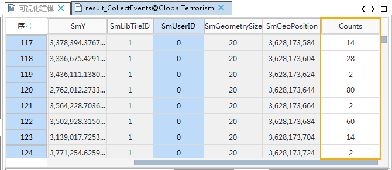

收集事件工具可将事件点数据转换为加权点数据，如犯罪或疾病事件点。用于数据的简单处理，目的是为了与其他空间统计分析功能结合使用。适用于点、线、面数据集。

### 分析原理

收集事件，将事件数据转换成加权数据。

  * 结果点数据集中包含一个 Counts 字段,该字段会保存每个唯一位置所有质心的总和。
  * 收集事件只会处理质心坐标完全相同的对象,并且只会保留一个质心,去除其余的重复点。
  * 对于点、线和面对象，在距离计算中会使用对象的质心。对象的质心为所有子对象的加权平均中心。点对象的加权项为1（即质心为自身），线对象的加权项是长度，而面对象的加权项是面积。

###  功能入口

  * 在 **空间分析** 选项卡-> **空间统计分析** -> **实用工具** -> **收集事件** ；
  * **工具箱** -> **空间统计分析** 工具-> **实用工具** -> **收集事件** ；(iDesktopX)

###  主要参数

  * **源数据** ：设置待分析的矢量数据集，支持点、线、面三种类型的数据集。
  * **结果设置** ：设置结果数据所要保存在的数据源，及数据集名称。

以阿富汗和巴基斯坦1947-2016年的恐怖袭击数据为例，进行收集事件后得到的加权值如下图所示，Counts字段记录了每个事件点发生恐怖袭击的次数。

###  相关主题

 [聚类和异常值分析](ClusterOutlierAnalyst)

 [优化的热点分析](OptimizedHotSpotAnalyst)

 [分析模式](AnalyzingPatterns)

