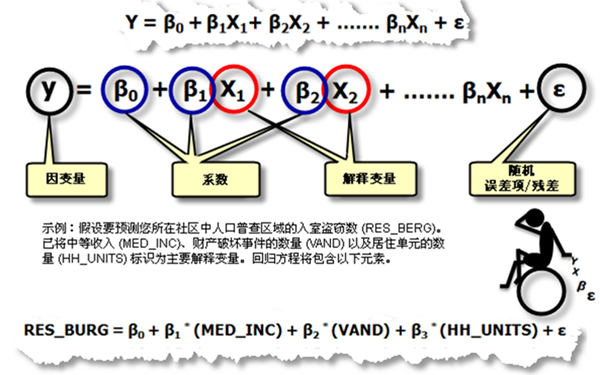
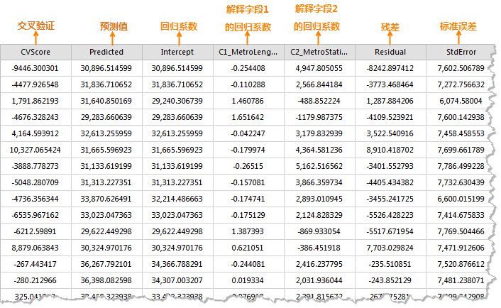
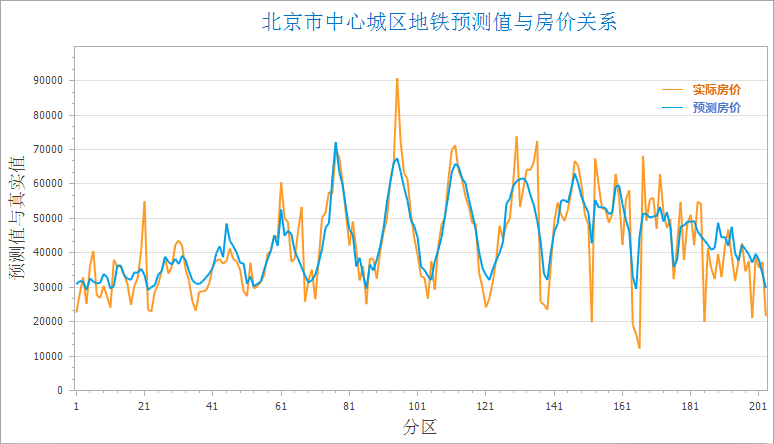
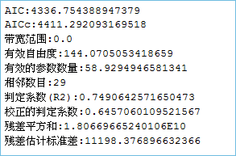
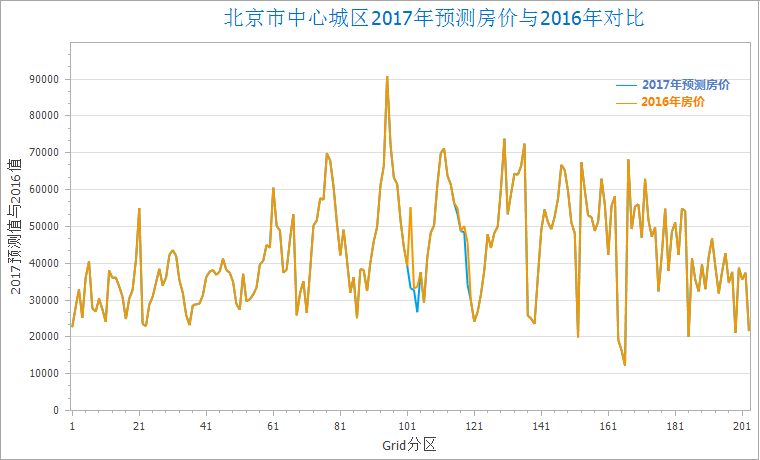

除了分析空间模式之外，GIS 分析还可用于挖掘或量化要素间关系。“空间关系建模”可利用回归分析建立空间关系模型。从而使您可以对未知值进行预测或更好地理解可对要建模的变量产生影响的关键因素。

可以解决以下类型的问题：为什么某一现象会持续的发生,是什么因素导致了这种情况？对某种现象建模以预测其他地点或者其他时间的数值？

地理加权回归是近年来提出的一种新的空间分析方法，为局部回归模型，它通过将空间结构嵌入线性回归模型中，以此来探测空间关系的非平稳性。通过回归分析，我们可以对空间关系进行建模、检查和探究，还可以解释所观测到的空间模式背后的诸多因素，还可以对这些现象进行预测。

### 分析原理

地理加权回归(GWR) 是若干空间回归技术中的一种，越来越多地用于地理及其他学科。通过使回归方程适合数据集中的每个要素，地理加权回归(GWR) 可为您要尝试了解、预测的变量或过程提供局部模型。地理加权回归(GWR )构建这些独立方程的方法是：将落在每个目标要素的带宽范围内的要素的因变量和解释变量进行合并。带宽的形状和大小取决于用户输入的核类型、带宽方法、距离以及相邻点的数目参数。是一种用于建模空间变化关系的线性回归的局部形式。

地理加权回归方程是一个可利用一个或多个解释变量对因变量进行最佳预测的数学公式。回归方程中的因变量总是标记为 **y** ，自变量或解释变量总是标记为 **X** ，这种表示方式对于那些将 x 和 y 视为坐标的地理学界的专业人员来说可能有些不便。每个自变量都与一个描述该变量与因变量之间关系强度和符号的回归系数相关联。回归方程的可能形式如下，其中，y 是因变量，X 是解释变量，β 是回归系数。

地理加权回归分析首先要确定一个研究区域，利用每个要素的不同空间位置，去计算衰减函数，这个是一个连续的函数，有了这个衰减函数，当你把每个要素的空间位置（一般是坐标信息（x,y))和要素的值带入到这个函数里面之后，就可以得到一个权重值（β），这个值就可以带入到回归方程里面去。如下衰减函数中的W(ui，vi）是空间权重矩阵。

### 应用案例

回归分析方法被广泛地用于解释市场占有率、销售额、品牌偏好及市场营销效果。把两个或两个以上定距或定比例的数量关系用函数形势表示出来，就是回归分析要解决的问题。其中的一些应用示例包括：

  * 对中学留校率建模以更好地了解有助于孩子们继续留在学校里读书的各种因素。
  * 构建交通事故与速度、路况、天气等因素之间的函数，以便为警方提供数据参考信息，旨在降低交通事故率。
  * 构建因火灾造成的财产损失与消防部门的介入程度、响应时间或财产价值等变量之间的函数。如果发现响应时间为关键因素，则表示您可能需要建造更多的消防站。如果发现介入程度为关键因素，则表示您可能需要增加设备和消防队员的数量。

###  功能入口

  * 在 **空间分析** 选项卡-> **空间统计分析** -> **空间关系建模** -> **地理加权回归分析** ；
  * **工具箱** -> **空间统计分析** 工具-> **空间关系建模** -> **地理加权回归分析** ；（iDesktopX）

### 主要参数

  * **源数据** ：设置待分析的矢量数据集，支持点、线、面三种类型的数据集。注意：源数据中的对象个数要大于20。
  * **解释字段** ：解释变量是自变量，即回归方程里面的X，用于对因变量的值进行建模或预测。例如，我们想研究肥胖的诸多原因，想找到肥胖与收入、健康食品摄入、教育水平等因素是否有关联。在这个例子中，肥胖就是因变量（Y），收入、健康食品摄入、教育水平等这些因素即为解释变量（X）。
  * **核函数类型** ：设置两点之间距离权重的计算函数类型，支持以下五种核函数类型，各函数计算公式中：W_ij为点i和点j之间的权重。d_ij为点i和点j之间的距离，b为带宽范围。 
    * 二次核函数：如果d_ij≤b，W_ij=(1-(d_ij/b)^2))^2；否则 W_ij=0。
    * 盒状核函数：如果d_ij≤b， W_ij=1；否则 W_ij=0。
    * 高斯核函数：计算公式为：W_ij=e^(-((d_ij/b)^2)/2)。
    * 立方体核函数：如果d_ij≤b， W_ij=(1-(d_ij/b)^3))^3；否则 W_ij=0。 
  * **建模字段** ：因变量，即待研究、预测的变量，只支持数值字段。
  * **带宽方式** ：设置分析带宽范围的确定方式，支持以下三种确定方式： 
    * Akaike 信息准则(AICc)：使用Akaike 信息准则 (AICc)确定带宽范围，适用于不确定距离或相邻要素的数目参数的情况下使用。
    * 交叉验证：使用交叉验证的方式确定带宽范围，交叉验证在回归系数估计时，不包括回归点本身，即只根据回归点周围的数据点进行回归计算。该值就是每个回归点在交叉验证中得到的估计值与实际值之差，它们的平方和为CV值。适用于不确定距离或相邻要素的数目参数的情况下使用。
    * 固定距离或相邻数：根据固定距离或固定相邻数确定带宽范围，必须设置距离或相邻要素数量的值。
  * **带宽类型** ：提供了固定型带宽和可变型带宽两种： 
    * 固定型带宽：若用户选择的带宽方式是固定距离或相邻数，则需要设置“带宽范围”，指定一个值为固定距离；若用户选择的带宽方式是AICc或交叉验证，用户不需要指定距离，程序可根据数据计算一个固定距离值。
    * 可变型带宽：若用户选择的带宽方式是固定距离或相邻数，则需要设置“相邻数目”，应用程序会根据回归点与最近相邻点之间的距离作为带宽范围；若用户选择的带宽方式是AICc或交叉验证，用户不需要指定相邻数目，程序可根据数据找到相邻点并计算一个固定距离值。
  * **结果设置** ：设置结果数据所要保存在的数据源，及数据集名称。

### 结果输出

结果数据集包含结果属性字段：交叉验证(CVScore)、预测值(Predicted)、回归系数(Intercept、C1/_解释字段名)、残差(Residual)、标准误差(StdError)、系数标准误差(SE/_Intercept、SE1/_解释字段名)、伪t值(TV_Intercept、TV1_解释字段名)和Studentised残差(StdResidual)。如下图所示：

  * 交叉验证(CVScore)：该值就是每个回归点在交叉验证中得到的估计值与实际值之差，它们的平方和为CV值。作为一个模型性能指标。

  * 预测值(Predicted)：这些值是地理加权回归得到的估计值（或拟合值）。

  * 回归系数(Intercept)：它是地理加权回归模型的回归系数，为回归模型的回归截距，表示所有解释变量均为零时因变量的预测值。

  * 回归系数（C1_ _解释字段名）：它是解释字段的回归系数，表示解释变量与因变量之间的关系强度和类型。如果回归系数为正，则解释变量与因变量之间的关系为正向的；反之，则存在负向关系。如果关系很强，则回归系数也相对较大；关系较弱时，则回归系数接近于0。

  * 残差（Residual）：这些是因变量无法解释的部分，是估计值和实际值之差，标准化残差的平均值为0，标准差为1。残差可用于确定模型的拟合程度，残差较小表明模型拟合效果较好，可以解释大部分预测值，说明这个回归方程是有效的。

  * 标准误差(StdError)：估计值的标准误差，用于衡量每个估计值的可靠性。较小的标准误差表明拟合值与实际值的差异程度越小，模型拟合效果越好。

  * 系数标准误差（SE_Intercept、SE1_ _解释字段名）:这些值用于衡量每个回归系数估计值的可靠性。系数的标准误差与实际系数相比较小时，估计值的可信度会更高。较大的标准误差可能表示存在局部多重共线性问题。

  * 伪t值(TV_Intercept、TV1_ _解释字段名)：是对各个回归系数的显著性检验。当T值大于临界值时，拒绝零假设，回归系数显著即回归系估计值是可靠的；当T值小于临界值时，则接受零假设，回归系数不显著。

  * Studentised 残差（StdResidual）：残差和标准误差的比值，该值可用来判断数据是否异常，若数据都在（-2，2）区间内，表明数据具有正态性和方差齐性；若数据超出（-2，2）区间，表明该数据为异常数据，无方差齐性和正态性。

下图为地理加权回归分析的预测值与实际值的对比图，根据2016年北京市中心城区的房价，以周围的地铁站个数和地铁线路长度为解释变量，模拟出2016年北京市中心城区的房价，下图中的橘色线为实际房价蓝色线为拟合房价。

执行成功后，输出窗口会输出本次分析的结果信息，如下图所示。若分析结果的残差在用户的接受范围内，即可根据该结果及解释变量，预测事件的结果。

此时，可根据地理加权回归分析的结果属性值及2017年新增的地铁站和地铁线路长度，对2017年北京市中心城区的房价进行预测，计算公式为：2017预测房价 =
Intercept(回归系数) + C1(解释字段1回归系数) * 2017地铁站 + C2(解释字段2回归系数) *
2017地铁线长度。根据该公式可根据地铁的变化信息，预测北京中心城区2017年的房价，结果如下图所示，从结果图中可知，地铁线路有变化的地区房价又有一定的波动。

###  相关主题

 [基础词汇](BasicVocabulary)

 [度量地理分析](MeasureGeographicDistributions)

 [聚类分布](Clusters)

 [分析模式](AnalyzingPatterns)

