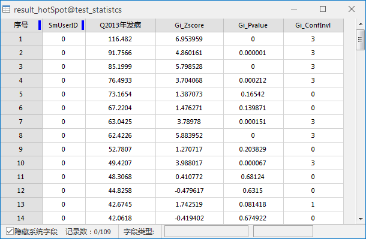
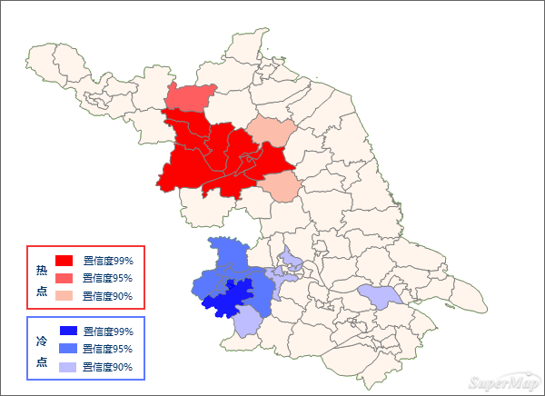

热点分析是给定一组加权要素，使用局部 General G 指数统计识别具有统计显著性的热点和冷点。热点分析会查看邻近要素环境中的每一个要素，因此，仅仅一个孤立的高值不会构成热点，单个要素以及它周边的都是高值，即该区域是高值和高值的聚集区，才称之为热点。反之，冷点表示不但本身的值很低，它邻接的都是低值，即是低值和低值的聚集区。

### 应用案例

应用领域包括：犯罪分析、流行病学、投票模式分析、经济地理学、零售分析、交通事故分析以及人口统计学。其中的一些应用示例包括：

  * 疾病集中爆发在什么位置？ 
  * 何处的厨房火灾在所有住宅火灾中所占的比例超出了正常范围？ 
  * 紧急疏散区应位于何处？ 
  * 峰值密集区出现于何处/何时？ 
  * 我们应在哪些位置和什么时间段分配更多的资源？

###  功能入口

  * 在 **空间分析** 选项卡-> **空间统计分析** -> **聚类分布** -> **热点分析** ；
  * **工具箱** -> **空间统计分析** 工具-> **聚类分布** -> **热点分析** ；(iDesktopX)

###  主要参数

  * **源数据** ：设置待分析的矢量数据集，支持点、线、面三种类型的数据集。
  * **评估字段** ：设置分析要素参与分析的属性字段值，仅支持数值型字段。
  * **概念化模型** ：选择应反映要分析的要素之间的固有关系，设置要素在空间中彼此交互方式构建的模型越逼真，结果就越准确。 
    * 固定距离模型：适用于点数据、及面大小变化较大的面数据。
    * 面邻接模型(共边、相交)：适用于存在相邻边、相交的面数据。
    * 面邻接模型(邻接点、共边、相交)：适用于有邻接点、相邻边、相交的面数据。
    * 反距离模型：所有要素均被视为所有其他要素的相邻要素，所有要素都会影响目标要素，但是随着距离的增加，影响会越小，要素之间的权重为距离分之一，适用于连续数据。
    * 反距离平方模型：与"反距离模型"相似,随着距离的增加，影响下降的更快，要素之间的权重为距离的平方分之一。
    * K最邻近模型：距目标要素最近的K个要素包含在目标要素的计算中（权重为1）,其余的要素将会排除在目标要素计算之外（权重为0）。如果想要确保具有一个用于分析的最小相邻要素数，该选项非常有效。当数据的分布在研究区域上存在变化以致于某些要素远离其他所有要素时，该方法十分适用。当固定分析的比例不如固定相邻对象数目重要时，K 最近邻方法较适合。
    * 空间权重矩阵：需要提供空间权重矩阵文件，空间权重是反映数据集中每个要素和其他任何一个要素之间的距离、时间或其他成本的数字。如果要对城市服务的访问性进行建模，例如要查找城市犯罪集中的地区，借助网络对空间关系进行建模是一个好办法。分析之前使用生成网络空间权重工具创建一个空间权重矩阵文件 (.swmb)，然后指定提供所创建的 SWMB 文件的完整路径。
    * 无差别区域模型：该模型是"反距离模型"和"固定距离模型"的结合，会将每个要素视为其他各个要素的相邻要素，该选项不适合大型数据集，在指定的固定距离范围内的要素具有相等的权重（权重为1）；在指定的固定距离范围之外的要素,随着距离的增加，影响会越小。
  * **中断距离容限** ："-1"表示计算并应用默认距离，此默认值为保证每个要素至少有一个相邻的要素；"0"表示为未应用任何距离，则每个要素都是相邻要素。非零正值表示当要素间的距离小于此值时为相邻要素。
  * **反距离幂指数** ：控制距离值的重要性的指数，幂值越高，远处的影响会越小。
  * **相邻要素数目** ：设置一个正整数，表示目标要素周围最近的K个要素为相邻要素。
  * **距离计算方法** ：距离计算的方法采用欧氏距离和曼哈顿距离。有关欧式距离和曼哈顿距离的详细描述，请参看[空间统计分析基本词汇](BasicVocabulary)。
  * **是否进行FDR校正** ：若进行FDR（错误发现率）校正，则统计显著性将以错误发现率校正为基础，否则，统计显著性将以P值和z得分字段为基础。
  * **自身权重字段** ：设置距离权重值，仅支持数值型字段。
  * **结果设置** ：设置结果数据所要保存在的数据源，及数据集名称。

### 结果输出

热点分析返回的结果数据集将会包含三个属性字段：z 得分(Gi_Zscore)和 P 值(Gi_Pvalue)、置信区间(Gi_ConfInvl)。
字段含义解释如下：

Z 得分(标准差) | 代表的含义 | 热点与冷点的分析  
---|---|---  
Z>0 且 P值小 | 表示高值的空间聚类。Z得分越高，聚类程度越大。 | 热点，对应的 Gi_ConfInvl 字段为正数。  
Z 接近于0 | 表示不存在明显的空间聚类。 | \--  
Z<0 且 P值小  | 表示低值的空间聚类。z 得分越越低，聚类程度就越大 | 冷点，对应的 Gi_ConfInvl 字段为负数。  
  
属性表中，详细值的对照含义：

Z 得分(标准差) | P 值(概率) | Gi_ConfInvl 值 | 置信度 | 分析结果  
---|---|---|---|---  
＜-2.58  | ＜0.01 | -3 | 99% | 冷点，具有置信度为99%的统计显著性。  
＜ -1.96  | ＜ 0.05 | -2  | 95% | 冷点，具有置信度为95%的统计显著性。  
＜-1.65 | ＜0.1  | -1 | 90% | 冷点，具有置信度为90%的统计显著性。  
＜接近于0 | \-- | 0 | \-- | 没有统计意义。  
＞1.65 | ＜0.1  | 1 | 90% | 热点，具有置信度为90%的统计显著性。  
＞1.96  | ＜ 0.05 | 2  | 95% | 热点，具有置信度为95%的统计显著性。  
＞2.58  | ＜0.01 | 3 | 99% | 热点，具有置信度为99%的统计显著性。  
  
**实例**：对某区域2013年病毒性肝炎发病率进行热点分析，设置评估字段为2013年发病数，概念化模式为反距离模型，距离计算方法为欧式距离，对空间权重矩阵进行标准化，其它默认。得到结果数据集属性表如下所示：

在随机分布的假设下，结果表明：

  * 该地区的西北方向的红色区域 Z值均大于2.58，该区域被高值所包围，呈现出了高值聚类，由此形成了发病人数较高的地区空间聚集的分布特征。由此可以得出西北方向呈显著性的地区是高值包围高值的地区，有5个左右，呈现出了明显的高值聚集区域，是病毒性肝炎的高危区域，需要着重的采取预防措施。
  * 图中深蓝色区域Z值均为小于-2.58，该区域被低值所包围，呈现出低值聚类，因此形成发病人数较低的区域，即冷点区域。
  * 淡粉色区域Z值接近于0，均为非统计特征区域。

###  相关主题

[聚类和异常值分析](ClusterOutlierAnalyst)

[优化的热点分析](OptimizedHotSpotAnalyst)

[分析模式](AnalyzingPatterns)

