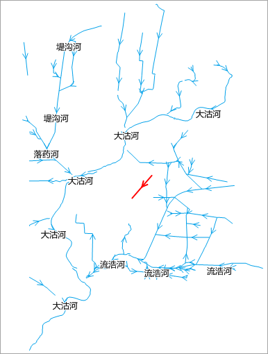

线性方向平均值可用于分析线对象的主体方向，一般线状要素通常都会指向一个方向，即从起点的位置指向终点的方向。可用于表示实际中的一些信息，比如车辆的行车轨迹，每一次转弯，都表示一段行程；或者是飓风运动的轨迹。当然，也有一些线是没有方向的，比如等高线。而还有一类线段，他们可能有方位值，但是没有方向值，如断层线反映断层的延伸方向和延伸规模，这种断层线一般的描述是“具有西北-东南方位”，但是不具有具体的方向性。

### 应用案例

  * 比较两组或多组线。例如，研究河谷中麋鹿和驼鹿迁移状况，野生生物学家们可以通过计算这两个物种迁徙路径，来获得它们迁徙的方向趋势。
  * 比较不同时期的要素。例如，鸟类学家可逐月计算猎鹰迁徙的趋势。现在很多动物研究都在样本身上绑上了GPS一类的收集数据的仪器，但是样本一多，就会变得杂乱无章。方向平均值可以汇总多个个体的飞行路径，并对每日的迁移进行平滑处理。这样便可很容易地了解鸟类在哪个月行进得最快，以及迁徙在何时结束。
  * 可以用动态和静态的数据进行对比，比如评估森林中的伐木状况以了解该区域天气情况中的风型和风向。
  * 在冰川学研究中，分析可以指示冰川移动方式的冰擦痕。
  * 在犯罪研究中，可以用来标识汽车失窃及被盗车辆追回的大体方向。

### 功能入口

  * 在 **空间分析** 选项卡-> **空间统计分析** -> **度量地理分析** -> **线性方向平均值** ；
  * **工具箱** -> **空间统计分析** 工具-> **度量地理分析** -> **线性方向平均值** ；(iDesktopX)

### 主要参数

  * **源数据** ：设置待分析的矢量线数据集。

  * **分组字段** ：将分析要素分类别的字段，分类后每一组的对象分别会有一个椭圆，分组字段可以是整型、日期型或字符串类型。若分组字段中字段值为空，则会将该要素从分析中排除。

  * **权重字段** ：设置一个数值型字段为权重字段，例如：用一个交通事故等级字段作为权重字段，结果椭圆不仅可以反映事故的空间分布，还可以反映交通事故的严重程度。

  * **忽略起点和终点的方向顺序** ： 
    * 不勾选（默认）：计算方向平均值时使用起始点和终止点的顺序，线具有方向性（起点到终点）。
    * 勾选：计算方向平均值时将忽略起始点和终止点的顺序，线不具有方向性（起点到终点或终点到起点具有相同的意义）。
  * **保留统计字段** ：在字段列表框中设置结果数据的保留字段及字段值的统计类型。

  * **结果设置** ：设置结果数据所要保存在的数据源，及数据集名称。

### 结果输出

最后会创建一个其中包含一条以所有输入数据的质心的平均中心点为其中心的线要素的新的要素类，线要素的长度等于所有输入数据的平均长度，而且其方位或方向是所有输入数据的平均方位或平均方向。

新的线要素的属性值如下：

  * CompassA -罗盘角（以正北为基准方向按顺时针旋转）
  * DirMean -方向平均值（以正东为基准方向按逆时针旋转）
  * CirVar -圆方差（用于测量线方向或方位偏离方向平均值的程度）
  * AveX和 AveY - 平均中心 X 和 Y 坐标
  * AveLen - 平均线长度

其他的估计都比较好理解，但是这个工具引入了一个叫做“圆方差”（thecircular variance）的概念，这是一个与标准差类似的概念，圆方差用来表示，你要进行分析的这些数据的方向的变异程度。圆方差范围为 0 至 1。如果所有分析数据具有完全相同（或非常相似）的方向，则圆方差将很小（接近于0）。当输入的数据方向跨越整个罗盘时，圆方差将很大（接近于1）。圆方差越大，分析的数据之间的方向变化越明显。

例如：下图为山东平度市和即墨市交界处部分河流和支流，通过计算线型方向平均值对这些河流的方向进行度量和描述。计算得到的结果为图中的红色线段。该线段以所有河流的质心的平均中心点为其中心，线段的长度等于所有河流的平均长度，而且其方位或方向为所有河流的平均方位或平均方向。

###  相关主题

 [中心要素](CentralFeature)

 [平均中心](MeanCenter)

 [中位数中心](MeanCenterResult)

 [方向分布](MeasureDirection)

 [标准距离](MeasureStandardDistance)
