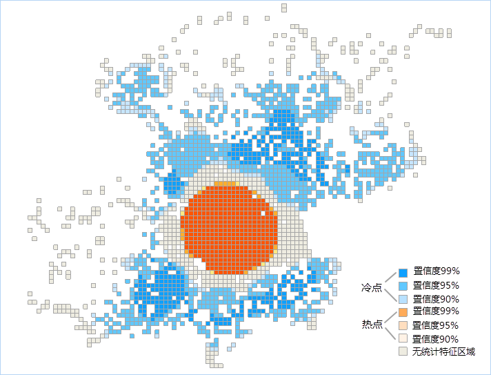
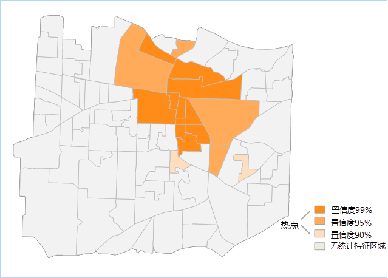

优化的热点分析是根据输入数据的特征，派生出参数来进行热点分析，通过结果面数据反映源数据的热点和冷点分布情况。例如，源数据集为事件点数据，则该功能会将事件点聚合到加权要素，分析事件点数据的分布范围，并分析各个区域事件点的分布是否为冷点或热点。

### 分析原理

优化的热点分析会根据输入要素、可选的评估字段、事件点发生区域、聚合方法，分析事件点在发生区域或网格中，是否属于热点区域或冷点区域。分析结果数据集中包括Counts、z得分（Gi_Zscore）、P值（Gi_Pvalue）和置信区间（Gi_ConfInvl）。

优化热点分析支持事件数据包括点、线、面三种，采用固定距离的概念化模型进行分析，并提供了4种聚合方法，每种聚合方法对输入事件点的最小个数有要求，具体说明如下表：

最小事件数 | 聚合方法 | 聚合后的最小要素数  
---|---|---  
60 | 网格面，不提供事件点发生区域的边界数据 | 30  
30 | 网格面，提供事件点发生区域的边界数据 | 30  
30 | 多边形，在设置的聚合面内计算事件点 | 30  
60 | 计算捕捉距离并使用该距离聚合附近的事件点 | 30  
  
### 应用案例

优化的热点分析用于识别具有统计显著性的高值（热点）和低值（冷点）的空间聚类。它自动聚合事件数据，识别适当的分析范围，并纠正多重测试和空间依赖性。该工具对数据进行查询，以确定用于生成可优化热点分析结果的设置。如果要完全控制这些设置，可以使用热点分析。

### 功能入口

  * 在 **空间分析** 选项卡-> **空间统计分析** -> **聚类分布** -> **优化的热点分析** ；
  * **工具箱** -> **空间统计分析** 工具-> **聚类分布** -> **优化的热点分析** ；(iDesktopX)

### 主要参数

  * **源数据** ：设置待进行优化热点分析的矢量数据集，支持点、线、面三种类型的数据集，例如：犯罪点、交通事故点等事件数据。
  * **评估字段** ：若提供了评估字段，则会直接执行分析；若未提供评估字段，则会利用提供的聚合方法，聚合所有输入事件点以获得计数，从而作为评估字段执行分析。如果源数据为点数据集，则评估字段可为空；若为线或面数据集，则需要设置评估字段。 
  * **聚合方法** ： 
    * 网格面：适用于事件点数据，该方法会根据事件点疏密程度，计算合适的网格大小,创建网格面数据集，生成的网格面数据集以面网格单元的点计数将作为分析字段执行热点分析。网格会覆盖在输入事件点的上方，并将计算每个面网格单元内的点数目。如果未提供事件点发生区域的边界面数据，则会利用输入事件点数据集范围划分网格，并且会删除不含点的面网格单元，仅会分析剩下的面网格单元；如果提供了边界面数据，则只会保留并分析在边界面数据集范围内的面网格单元。
    * 聚合面：适用于事件点数据，需要设置聚合事件点用于统计事件计数的面数据集，将计算每个面对象内的点事件数目，然后对面数据集以点事件数目作为分析字段执行热点分析。
    * 聚合点：适用于事件点数据，为输入事件点数据集计算捕捉距离并使用该距离聚合附近的事件点，为每个聚合点提供一个点计数，代表聚合到一起的事件点数目，然后对生成聚合点数据集以聚合在一起的点事件数目作为分析字段执行热点分析。
  * **分析范围** ：设置面数据集，作为事件点发生区域的边界面数据集。
  * **结果设置** ：设置结果数据所要保存在的数据源、及数据集名称。

### 结果输出

设置好以上参数后，单击对话框中的“确定”按钮，即可执行优化的热点分析，下图为北京微博登录位置的优化热点分析网格结果图，图中的橘色为热点区域，蓝色点为冷点区域，茶色为非统计特征区域。

若设置聚合面，则得到结果会如下图所示，下图为某区域911电话的优化热点分析结果图中的橘色为热点区域，蓝色点为冷点区域，茶色为非统计特征区域。

热点分析返回的结果数据集将会包含四个属性字段：Counts、z 得分(Gi_Zscore)和 p
值(Gi_Pvalue)、置信区间(Gi_ConfInvl)。

  * Counts 统计了对应分析区域包含的点个数，只有当源数据集为点数据集且不设置评估字段的前提下，统计结果中才会出现该结果字段。
  * z 得分高且 p 值小，则表示有一个高值的空间聚类。如果 z 得分低并为负数且 p 值小，则表示有一个低值的空间聚类。z 得分越高（或越低），聚类程度就越大。如果z 得分接近于零，则表示不存在明显的空间聚类。
  * 在具有空间聚集性的前提下，Z得分为负值，则表示该处为一个冷点区域，对应的 Gi_ConfInvl 字段为负数；Z 得分为正值，则表示该处为一个热点区域，对应的 Gi_ConfInvl 字段为正数。
  * Gi_ConfInvl 字段会识别统计显著性的热点和冷点。Gi_ConfInvl 为+3 和-3 的要素反映置信度为 99%的统计显著性；Gi_ConfInvl 为+2 和-2 的要素反映置信度为 95% 的统计显著性；Gi_ConfInvl 为+1 和-1 的要素反映置信度为 90%的统计显著性；而Gi_ConfInvl 为 0 的要素的聚类则没有统计意义。 

如下表所示：

Z 得分(标准差) | P 值(概率) | Gi_ConfInvl 值 | 置信度  
---|---|---|---  
<-1.65 或 >1.65 | <0.10 | -1 , 1 | 90%  
<-1.96 或 >1.96 | <0.05 | -2 , 2 | 95%  
<-2.58 或 >2.58 | <0.01 | -3 , 3 | 99%  
  
###  相关主题

[聚类异常值分析](ClusterOutlierAnalyst)

[热点分析](HotSpotAnalyst)

[分析模式](AnalyzingPatterns)

