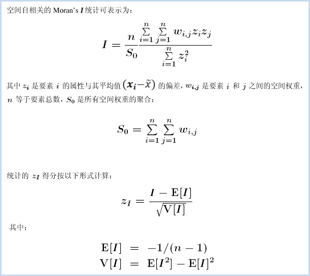
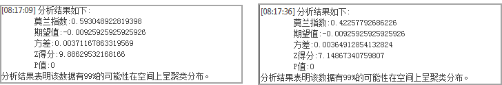

根据指定的要素及相关属性，使用全局莫兰指数统计量评估要素所表达的模式是聚类模式、离散模式还是随机模式。

### 分析原理

空间自相关的统计值可根据以下公式计算：

Global Moran's I
统计量所依据的数学公式如上所示。该工具计算所评估属性的均值和方差。然后，将每个要素值减去均值，从而得到与均值的偏差。将所有相邻要素（例如位于指定距离范围内的要素）的偏差值相乘，从而得到差积，Global
Moran’s I 统计量的分子是这些差积的和。

空间自相关 (Global Moran's I)
工具计算了指数值后，将计算期望指数值。然后，将期望指数值与观察指数值进行比较。在给定数据集中的要素个数和全部数据值的方差的情况下，该工具将计算 z 得分和
p 值，用来指示此差异是否具有统计学上的显著性。指数值不能直接进行解释，只能在零假设的情况下进行解释。

### 应用案例

  * 通过查找距离（即空间自相关最强位置对应的距离），可为各种空间分析方法确定合适的邻近距离。
  * 度量种族或民族分离随时间推移的总体趋势 - 分离程度是逐渐增强还是逐渐减弱？
  * 总结某种观点、疾病或趋势随空间和时间变化的传播情况 - 观点、疾病或趋势是保持隔离和集中，还是传播开并变得更加分散？

### 功能入口

  * 在 **空间分析** 选项卡-> **空间统计分析** -> **分析模式** -> **空间自相关** ；
  * **工具箱** -> **空间统计分析** 工具-> **分析模式** -> **空间自相关** ；(iDesktopX)

### 主要参数

  * **源数据** ：设置待分析的矢量数据集，支持点、线、面三种类型的数据集。建议源数据中的对象个数大于或等于30，以保证结果的可靠性。
  * **评估字段** ：设置分析要素参与分析的属性字段值，仅支持数值型字段。
  * **概念化模型** ：选择应反映要分析的要素之间的固有关系，设置要素在空间中彼此交互方式构建的模型越逼真，结果就越准确。 
    * 固定距离模型：适用于点数据、及面大小变化较大的面数据。
    * 面邻接模型(共边、相交)：适用于存在相邻边、相交的面数据。
    * 面邻接模型(邻接点、共边、相交)：适用于有邻接点、相邻边、相交的面数据。
    * 反距离模型：所有要素均被视为所有其他要素的相邻要素，所有要素都会影响目标要素，但是随着距离的增加，影响会越小，要素之间的权重为距离分之一，适用于连续数据。
    * 反距离平方模型：与“反距离模型”相似,随着距离的增加，影响下降的更快，要素之间的权重为距离的平方分之一。
    * K最邻近模型：距目标要素最近的K个要素包含在目标要素的计算中（权重为1）,其余的要素将会排除在目标要素计算之外（权重为0）。如果想要确保具有一个用于分析的最小相邻要素数，该选项非常有效。当数据的分布在研究区域上存在变化以致于某些要素远离其他所有要素时，该方法十分适用。当固定分析的比例不如固定相邻对象数目重要时，K 最近邻方法较适合。
    * 空间权重矩阵：需要提供空间权重矩阵文件，空间权重是反映数据集中每个要素和其他任何一个要素之间的距离、时间或其他成本的数字。如果要对城市服务的访问性进行建模，例如要查找城市犯罪集中的地区，借助网络对空间关系进行建模是一个好办法。可选择已有的空间权重矩阵文件 (.swmb)，也可根据源数据集创建一个新的空间矩阵文件。
    * 无差别区域模型：该模型是”反距离模型”和”固定距离模型”的结合，会将每个要素视为其他各个要素的相邻要素，该选项不适合大型数据集，在指定的固定距离范围内的要素具有相等的权重（权重为1）；在指定的固定距离范围之外的要素,随着距离的增加，影响会越小。
  * **中断距离容限** ：“-1”表示计算并应用默认距离，此默认值为保证每个要素至少有一个相邻的要素；“0”表示为未应用任何距离，则每个要素都是相邻要素。非零正值表示当要素间的距离小于此值时为相邻要素。
  * **反距离幂指数** ：控制距离值的重要性的指数，幂值越高，远处的影响会越小。
  * **相邻数目** ：设置一个正整数，表示目标要素周围最近的K个要素为相邻要素。当概念化模型选择的是“K最邻近模型”时需要设置该参数。
  * **距离计算方法** ：距离计算的方法采用欧氏距离和曼哈顿距离。有关欧式距离和曼哈顿距离的详细描述，请参看[空间统计分析基本词汇](BasicVocabulary)。
  * **空间权重矩阵标准化** ：当要素的分布由于采样设计或施加的聚合方案而可能偏离时，建议使用空间权重矩阵标准化。选择空间权重矩阵标准化后，每个权重都会除以行的和（所有相邻要素的权重和）。空间权重矩阵标准化的权重通常与固定距离相邻要素结合使用，并且几乎总是用于基于面邻接的相邻要素。这样可减少因为要素具有不同数量的相邻要素而产生的偏离。空间权重矩阵标准化将换算所有权重，使它们在 0 和 1 之间，从而创建相对（而不是绝对）权重方案。每当要处理表示行政边界的面要素时，您都可能会希望选择“空间权重矩阵标准化”选项。

### 结果输出

设置好以上参数后，单击对话框中的“确定”按钮，即可执行空间自相关分析，分析结果会在输出窗口中展示。

空间自相关分析结果会返回：Moran's I 指数、期望值、方差、Z得分、 P值五个参数，使用 z 得分或 p 值指示统计显著性时，则可以拒绝零假设，如果 Moran's I 指数值为正值，就表示这份数据具有空间正相关性，数据集用于分析的值与空间聚集度成正比；如果 Moran's I 指数值为负则指示离散趋势。下表对结果的解释进行了汇总：

**分析结果** | **空间自相关**  
---|---  
p 值不具有统计学上的显著性。 | 不能拒绝零假设。要素值的空间分布很有可能是随机空间过程的结果。观测到的要素值空间模式可能只是完全空间随机性
的众多可能结果之一。  
p 值具有统计学上的显著性，且 z 得分为正值。 | 可以拒绝零假设。如果基础空间过程是随机的，则数据集中高值或低值的空间分布在空间上聚类的程度要高于预期。  
p 值具有统计学上的显著性，且 z 得分为负值。 |
可以拒绝零假设。如果基础空间过程是随机的，则数据集中高值和低值的空间分布在空间上离散的程度要高于预期。离散空间模式通常会反映某种类型的竞争过程 -
具有高值的要素排斥具有高值的其他要素；类似地，具有低值的要素排斥具有低值的其他要素。  
  
**实例** ：

现有某县区2013年发病率、2013年发病数病毒性肝炎数据。分别对病毒性肝炎县区数据的2013年发病率和2013年发病数进行空间自相关分析，设置评估字段分别为2013年发病率和2013年发病数，概念化模式为反距离模型，距离计算方法为欧式距离，对空间权重矩阵进行标准化，其它默认。

通过分析结果可以得出以下结论：在随机分布的假设下，P值 < 0.01 且 z得分 > 2.58，2013年发病率和2013年发病数的分析结果具有99%的置信度是具有显著性的。

Moran’s I > 0 , Moran’s I显著为正存在显著的正相关性，观测值2013年发病率和2013年发病数都趋于空间聚集。说明空间分布越聚集的地方，相应发病数和发病率也越高。

###  相关主题

[高低值聚类](HighLowClustering)

[增量空间自相关](IncrementalSpatialAutocorrelation)

[平均最近邻](AverageNearestNeighbor)

