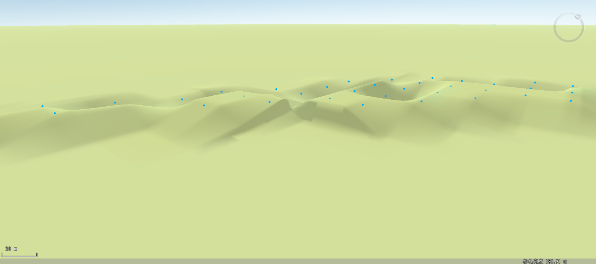

### 使用说明

通过构建DEM功能可以构建区域内的大地形，当局部区域微地形发生变动时，我们可以通过点修改地形功能进行调整。在点修改地形过程中，在原地形数据基础上，通过高程测量点（或从等高线中进行采样提取高程点）进行数据内插，通过插值生成新的DEM栅格数据。

### 操作说明

1. 在“ **空间分析** ”选项卡的“ **栅格分析** ”组中，单击“ **DEM 构建** ”下拉按钮，在弹出的下拉菜单中选择“ **点修改地形** ”命令，弹出“点修改地形”对话框。
2. 设置需要进行点修改地形的 DEM 数据。选择 DEM 数据所在的数据源以及栅格数据集。
3. 设置点数据。选择点数据所在的数据源以及点数据集。注：这里的点数据集只能为三维点数据集。
4. 参数设置。 
  * **缓冲半径（米）** ：输入缓冲半径值。默认为5米。
5. 设置结果数据。选择结果数据存放的数据源以及确定结果数据集名称。
6. 以上参数设置完成后，单击"确定"按钮，执行 DEM 挖湖操作；单击"取消"按钮，退出当前操作。
7. 将生成的栅格数据集加载到当前场景中时，出现“提示”框，提示必须创建影像金字塔才能加载到场景中，点击确认后弹出如下提示框，选择栅格数据集加载类型。

如图所示为点修改地形前后的对比效果图。

 |   
---|---  
图：处理前的地形 | 图：处理后的地形  

