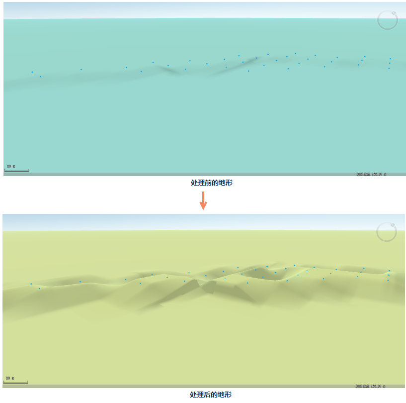

### 使用说明

通过构建DEM功能可以构建区域内的大地形，当局部区域微地形发生变动时，我们可以通过点修改地形功能进行调整。在点修改地形过程中，在原地形数据基础上，通过高程测量点（或从等高线中进行采样提取高程点）进行数据内插，通过插值生成新的DEM栅格数据。

### 功能入口

  * **空间分析** 选项卡-> **栅格分析** 组-> **DEM构建** -> **点修改地形** 。
  * **工具箱** -> **栅格分析** -> **DEM构建** -> **点修改地形** 。(iDesktopX) 

### 参数说明

  * **DEM数据** ：设置需要进行点修改地形的 DEM 数据。选择 DEM 数据所在的数据源以及栅格数据集。
  * **点数据** ：选择点数据所在的数据源以及点数据集。注：这里的点数据集只能为三维点数据集。
  * **缓冲半径（米）** ：输入缓冲半径值。默认为5米。
  * **结果数据** ：选择结果数据存放的数据源以及确定结果数据集名称。
  * 将生成的栅格数据集加载到当前场景中时，出现“提示”框，提示必须创建影像金字塔才能加载到场景中，点击确认后弹出如下提示框，选择栅格数据集加载类型。

如图所示为点修改地形前后的对比效果图。

  
