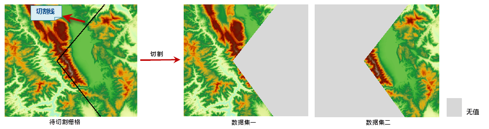

### 使用说明

当需要将已有栅格数据的一部分作为研究范围，且希望保持原有栅格数据的空间范围时，可以对栅格进行切割。

DEM
切割功能根据给定的一条二维线（称为“切割线”）对栅格数据集进行切割，切割的结果为两个新的栅格数据集，分别为切割线左侧和右侧的部分。切割线可以是直线、折线或多边形等。左侧和右侧是指切割线的节点序列方向的左侧和右侧。切割线所经过的那些单元格是分配到左侧还是右侧，即如果单元格的中心点位于分割线的左侧（或右侧），则该单元格分配到该侧。

  

  
### 操作说明

  1. 在“ **空间分析** ”选项卡的“ **栅格分析** ”组中，单击“ **表面分析** ”下拉按钮，在弹出的下拉菜单中选择“ **DEM 切割** ”项，在地图上画一条切割线，单击鼠标右键，弹出“DEM 切割”对话框。

  2. 设置需要进行切割操作的数据。选择待切割的源数据集及其所在的数据源。
  3. 设置切割结果数据。选择结果数据集所要保存在的目标数据源，并可为结果数据集一、结果数据集二命名。
  4. 以上参数设置完成后，单击"确定"按钮，执行 DEM 切割操作；单击"取消"按钮，退出当前操作。

### 备注

DEM 切割与栅格地图裁剪不同，DEM
切割得到的两个结果数据集的空间范围与原栅格数据的空间范围一致，无数据的部分被赋予“无值”，而栅格地图裁剪的结果为一个数据集，并且空间范围即为裁剪出来的区域的范围，比原数据的范围要小。

###  相关主题

[关于地图裁剪](../../DataProcessing/ClippingMap/MapClip_basic.htm)