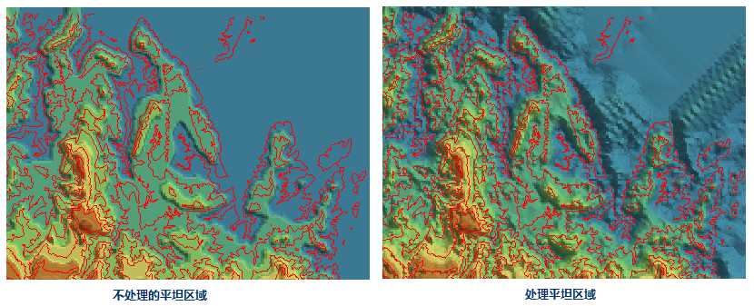

### 使用说明

地形数据是我们进行地形分析的基础。如我们可以利用地形数据提取坡度坡向的基础地形因子，以及进行水文分析、可视性分析等较复杂的地形分析功能。只有构建高质量的地形数据，才能保证我们后续分析结果的可靠。因此构建地形具有十分重要的意义。

应用程序提供的 DEM 构建功能，实现帮助使用者根据设置的参数构建地形，以及根据指定范围对地形高程值进行修改。

### 功能入口

  * **空间分析** 选项卡-> **栅格分析** 组-> **DEM 构建** -> **DEM 构建** 。
  * **工具箱** -> **栅格分析** -> **DEM 构建** -> **DEM 构建** 。(iDesktopX) 

### 参数说明

  * **源数据** ：选择参与构建 DEM 的矢量数据。
  * **湖数据** ：设置 DEM 挖湖的湖面数据。使用挖湖功能时，应用程序使用湖面数据字段的高程值替换 DEM 中对应位置的栅格值。
  * **裁剪数据** ：设置裁剪数据集，应用程序将对该裁剪数据区域覆盖的像元生成 DEM，区域外的部分将赋予无值。
  * **擦除数据** ：设置擦除数据集，应用程序将对擦除数据覆盖区域内的像元赋予无值，区域外的部分不做处理。注意：擦除数据集的设置仅在插值类型为不规则三角网(TIN)时有效。
  * **参数设置**
    * **插值类型** ：设置生成 DEM时，使用的插值方法。应用程序提供了三种插值方式，不规则三角网（TIN）、距离反比权重插值法（IDW）和克吕金插值法（Kriging）。关于这三种方法的介绍，请参阅[构建 DEM 概述](AboutTerrainBuilder)。
    * **重复点处理** ：设置重复点处理方式。在有些情况下，用于构建 DEM  的源数据有重复点（线对象的节点）的情况出现。应用程序提供了两类处理方式，第一种是使用其中一个点的高程值，将之后出现的其他重复点去除；另外一种采用重复点的所有高程值的统计值，如平均值、最大（小）值、众数、中位数等。
      * **平均值** ：取所有重复点的平均值作为该位置的高程值。
      * **中位数** ：取所有重复点高程值的中位数作为该位置的高程值。
      * **众数** ：取所有重复点高程值中出现次数最多的高程值作为该位置的高程值。
      * **最大值** ：取所有重复点高程值中的最大值作为该位置的高程值。
      * **最小值** ：去所有重复点高程值中的最小值作为该位置的高程值。
    * **重采样距离** ：设置重采样容限大小。重采样距离是指线上相邻两个节点之间，其中一个点到两点之间连线的垂距。距离越大，采样结果数据越简化。关于线重采样的介绍，请参阅[线状对象重采样说明](../../DataProcessing/Objects/EditObjects/ReSampleIntro)。
    * **高程缩放系数** ：用来设置高程被拉伸的程度。数值越大表示拉伸越大，地形越夸张。当系数为1表示不拉伸。数值单位为倍，即对高程相对于原始高度拉伸的倍数。
    * **处理平坦区域** ：一般程序判定的平坦区域是山峰或者谷底，无相邻等高线可进行插值的区域。当设置处理平坦区域，程序默认将平坦区域处添加插值点，从而平坦区域也将插值得到高程值。而不设置处理平坦区域则默认程序不对平坦区域再做处理。如下图所示，红色为等高线，根据该等高线构建DEM,处理平坦区域得到的 DEM 数据更符合真实地形，而不处理平坦区域得到的DEM 数据相对更平滑，规整。

  
  
  * **结果数据设置**
    * **数据源** ：生成的地形数据要保存的数据源。
    * **数据集** ：生成的地形数据（栅格数据）的名称。
    * **编码方式** ：设置生成的地形数据的编码方式。应用程序提供了三种编码方式，未编码、SGL 和 DCT。关于以上编码方式介绍的详细内容，请参阅[数据集压缩编码方式](../../DataProcessing/DataManagement/EncodeType)。
    * **像素格式** ：设置生成的地形数据的像素格式。应用程序提供了多种常用的像素格式，包括1位、4位、单字节、双字节、三字节、整型、长整型、单精度浮点型、双精度浮点型9种。有关每种像素格式的介绍内容，请参阅[栅格数据集像素格式](../VectorRasterConvert/PixelFormat)。
    * **分辨率** ：设置生成的 DEM 数据的分辨率。默认分辨率的计算公式是 L/500，其中，L 表示边界长度，取结果数据集的区域范围内宽（Width）和高（Height）之间最大的边的值，500表示边界 L 所容纳单元格的默认数量，计算结果为每个像元的大小。分辨率的单位与参与生成 DEM 的矢量数据的坐标系统单位保持一致。 

根据用户输入的分辨率大小，应用程序会自动估算生成的 DEM 的行数和列数，以及 DEM 大小（单位为：MB）。

  * **其他设置** ：主要是对进行挖湖的湖数据以及裁剪和擦除范围数据进行设置，均为可选参数。

###  注意事项

  * 对大规模的点、线数据可以使用“不规则三角网”插值类型创建 DEM，但是对计算机的内存要求较高。在操作之前请保证有足够的内存进行该操作，否则可能会由于内存不足而导致创建 DEM 失败。
  * 目前暂不支持利用距离反比权重（IDW）和克吕金（Kriging）的插值方法对大规模的点、线数据构建 DEM。

###  相关主题

 [DEM 构建概述](AboutTerrainBuilder)
