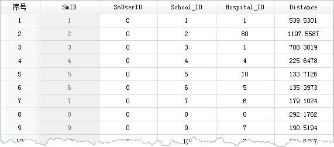
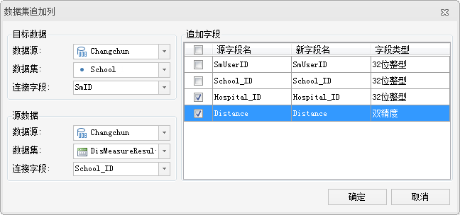
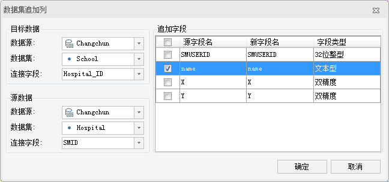
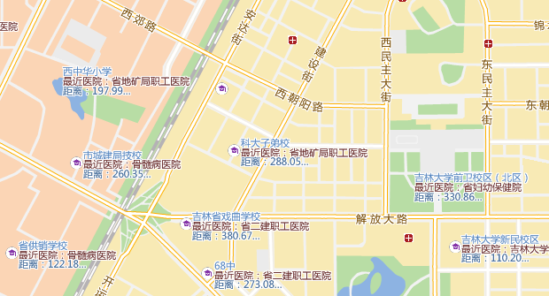

**主题：计算长春市与学校最近的医院及距离**

数据准备：长春市学校和医院点数据

操作步骤：

  1. 通过“距离计算”选项，计算出里学校最近的医院ID和距离，源数据选择学校点数据集，邻近数据选择医院点数据集，计算方式为最近距离，其他参数默认。

  2. 得到结果为属性表数据，记录了学校ID、与其最近的医院ID及距离信息。通过“追加列”功能，将结果属性表中的 Hospital_ID 和 Distance 字段信息追加到学校的点数据集中。        
  3. 再根据医院的ID号，将相应的医院名称追加到学校的点数据集中，具体参数设置如下：     

  4. 完成以上的追加列操作之后，学校点数据中有医院的ID、名称和它们之间的距离信息，对 School 数据集制作矩阵标签专题图，可直观体现学校最近的医院名称和距离等信息，结果如下所示：   

  
###  相关主题

[距离计算原理](DistanceMeasure_Theory)

[距离计算](DistanceMeasure)