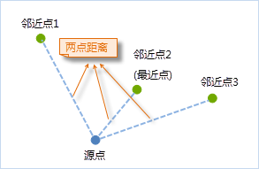
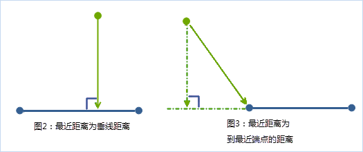
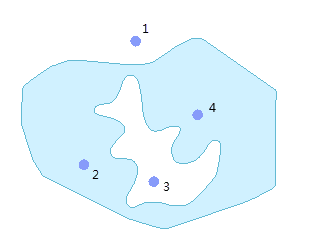

### 使用说明

距离计算用于计算点对象到其它点、线、面对象之间的最短间距，即两个对象之间最接近的距离。分析结果输出到属性表中，属性表中分别记录了源对象和邻近对象的 ID 及两对象之间的距离。进行距离计算时的注意事项有以下几点：
  * 源数据集与邻近数据集坐标系必须是相同的坐标系，才可进行距离计算，计算结果的距离单位与数据集坐标系单位一致。
  * 当与源对象距离相等的邻近对象为多个时，结果属性表中会同时记录这几个邻近对象的ID和距离。
  * 当两个对象存在包含、叠置关系时，两对象之间的距离为零。
  * 若计算的对象有面对象，则以面对象的边界来计算距离，如果另一个对象在面对象内，则距离为零。

### 距离计算原则

  1. **两个点对象之间的距离是连接两点的直线** 　两点之间的距离即为两点之间的连线距离，若计算最近距离，则会计算分别源点到临近点的距离，将最近的一个或多个等距离的临近点输出为结果。   
  2.  **点对象到线对象的距离是点到线的垂线或最近的节点的距离**　 点和线段之间的最短距离是点到线段的垂线，如果无法在线段的两个端点之间画出垂线，那么点到最近端点的距离为最短距离。当折线有多条线段时，先确定与点距离最近的线段，并以下图3所示方式计算出点到线的距离。　　 　  
  3. **点对象到面对象的距离是点到面边界的垂线或最近的节点的距离**

面对象是由一系列线段围绕而成的一个封闭的区域，因此，计算点到面的距离首先要确定与点距离最近的线段，再使用上图3所示方法计算出点到线的距离，即点到面对象的距离。若点不在面对象范围内，则距离值为正；若点包含在面对象中，则距离为零。如下图所示：点2和点4到面的距离为零，点1和点3到面的距离为正值。

  
 

###  相关主题

[距离计算](DistanceMeasure)

[距离计算应用实例](DistanceAnalyst_Example)