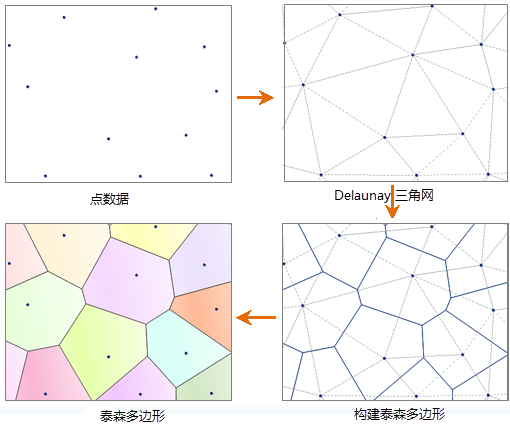

### 泰森多边形定义

泰森多边形是荷兰气候学家 A.H.Thiessen
提出的一种根据离散分布的气象站的降雨量来计算平均降雨量的方法，即将所有相邻气象站连成三角形，作这些三角形各边的垂直平分线，于是每个气象站周围的若干垂直平分线便围成一个多边形。用这个多边形内所包含的一个唯一气象站的降雨强度来表示这个多边形区域内的降雨强度，并称这个多边形为泰森多边形。

泰森多边形又称为 Voronoi 图，是由一组连接两邻点直线的垂直平分线组成的连续多边形组成。泰森多边形的特性为：

  * 每个泰森多边形内仅含有一个离散点数据；
  * 泰森多边形内的点到相应离散点的距离最近；
  * 位于泰森多边形边上的点到其两边的离散点的距离相等。

### 泰森多边形应用

泰森多边形可用于定性分析、统计分析、邻近分析等，通过创建泰森多边形创建的多边形要素可对可用空间进行划分并将其分配给最近的点要素。泰森多边形有时会用于替代插值操作，以便将一组样本测量值概化到最接近他们的区域。使用泰森多边形可将取自一组气候测量仪的测量值概化到周围区域，还可为一组店铺快速建立服务区模型等。例如：

  * 可以用离散点的性质来描述泰森多边形区域的性质；
  * 可用离散点的数据来计算泰森多边形区域的数据；
  * 判断一个离散点与其它哪些离散点相邻时，可根据泰森多边形直接得出，且若泰森多边形是 n 边形，则就与 n个离散点相邻；
  * 当某一数据点落入某一泰森多边形中时，它与相应的离散点最邻近，无需计算距离。

### 泰森多边形创建步骤

建立泰森多边形算法的关键是对离散数据点合理地连成三角网，即构建 Delaunay 三角网，建立泰森多边形的步骤如下：

  1. 对待建立泰森多边形的点数据进行由左向右，由上到下的扫描，如果某个点与前一个扫描点的距离小于给定的邻近容限值，那么分析时将忽略该点；
  2. 将离散的点数据构建 Delaunay 三角网，并对离散的点和构建的三角形编号，记录每个三角形是由哪个离散点构成的，同时记录与每个离散点相邻的所有三角形编号；
  3. 画出每个三角形边的中垂线，由这些中垂线构成泰森多边形的边，而中垂线的交点是相应的泰森多边形的顶点；
  4. 用于建立泰森多边形的点将成为相应的泰森多边形的锚点。

  
---  
图：构建泰森多边形步骤  
  
###  相关主题

 [构建泰森多边形](ThiessenPolygon.html)

 [泰森多边形应用实例](ThiessenAnalyst_Example.html)

* * *

  
  
---

