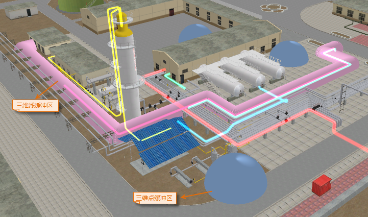
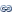

###  使用说明

三维缓冲区是指在三维点周围根据指定半径建立的球体，或在三维线数据周围根据指定半径建立圆柱体。

  * 目前，该功能只支持对三维点、三维线数据集生成缓冲区。
  * 由于数据类型的不同，在生成缓冲区时的参数设置也有不同。对线数据生成缓冲区，可以选择圆头缓冲或平头缓冲两种缓冲类型；而对点数据只能生成圆头缓冲。

###  应用场景

  * 爆炸物的危险范围分析；
  * 网络信号覆盖范围；
  * 辐射源辐射范围。

###  功能入口

  * 在 **空间分析** 选项卡->**矢量分析** -> **缓冲区** ->下拉菜单中选择"三维缓冲区"项；
  * **工具箱** -> **矢量分析** 工具-> **缓冲区** ->**三维缓冲区**；(iDesktopX)

###  参数说明

* **数据类型**：可选择三维点数据集或者三维线数据集生成缓冲区。对三维线数据生成缓冲区时需要设置缓冲类型，可以是圆头缓冲或者平头缓冲。下面以对三维线数据生成缓冲区为例，对“生成缓冲区”对话框中的参数予以说明。
* 设置缓冲数据。
   * **数据源：** 选择要生成缓冲区的数据集所在的数据源。
   * **数据集：** 选择要生成缓冲区的数据集。系统自动过滤选中的数据源下的数据集，只显示该数据源下的三维点和线数据集。
   * **只针对被选中对象进行缓冲操作**：在选中某一数据集中的对象情况下，“只针对被选中对象进行缓冲操作”前面的复选框可用。勾选该项，表示只对选中的对象生成缓冲区，同时不能设置数据源和数据集；取消勾选该项，表示对该数据集下的所有对象进行生成缓冲区的操作，可以更改生成缓冲区的数据源和数据集。
* 设置缓冲类型。缓冲类型的不同，需要设置的参数也不大相同。
   * **圆头缓冲：** 在线的两边按照缓冲距离绘制平行线，并在线的端点处以缓冲距离为半径绘制半圆，连接生成缓冲区域。默认缓冲类型为圆头缓冲。
   * **平头缓冲：** 生成缓冲区时，以线数据的相邻节点间的线段为一个矩形边，以左半径或者右半径为矩形的另外一边，生成形状为矩形的缓冲区域。
* 在“缓冲半径”文本框中输入数值可设置缓冲距离大小。输入的数值为双精度型数字，小数点位数为10位。最大值为1.79769313486232E+308，最小值为-1.79769313486232E+308。如果输入的值不在以上范围内，会提示超出小数位数。
* **半圆弧线段数(4-200)**： 用于设置生成的缓冲区边界的平滑度。数值越大，圆弧/弧段均分数目越多，缓冲区边界越平滑。取值范围为4-200。默认的数值大小为100。
* **在场景中展示：** 勾选该项，表示在生成缓冲区后，会将其生成的结果添加到当前场景窗口中。取消勾选该项，则不会自动将结果添加到当前场景窗口中。默认为勾选该项。
* 设置结果数据。
   * **数据源：** 选择生成的缓冲区结果要保存的数据源。
   * **数据集：** 输入生成的缓冲区结果要保存的数据集名称。如果输入的数据集名称已经存在，则会提示数据集名称非法，需要重新输入。
* 设置好以上参数后，点击“确定”按钮，执行生成缓冲区的操作。

  
  
###  相关主题

 [关于缓冲区分析](HowBufferWork)

 [生成缓冲区](SingleBuffer)

 [生成多重缓冲区](MutilBuffer)