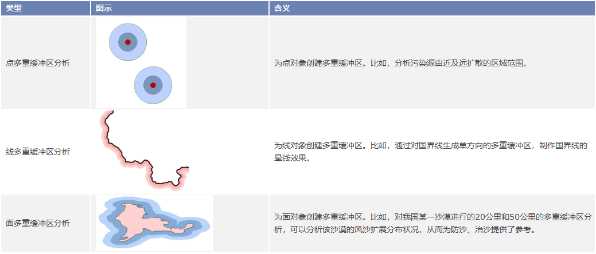

缓冲区分析（Buffer）是GIS的基本空间操作功能之一，是指根据指定的距离，在点、线、面几何对象周围自动建立一定宽度的区域的分析方法。例如，在环境治理时，常在污染的河流周围划出一定宽度的范围表示受到污染的区域；又如在飞机场，常根据健康需要在周围划分出一定范围的区域作为非居住区，等等。

用户可以使用应用程序中的“ **缓冲区** ”按钮或者“ **多重缓冲区** ”按钮，对一个或者多个几何对象生成指定距离的缓冲区。

缓冲区分析支持对点数据集、线数据集、面数据集生成缓冲区。不仅可以整个数据集的所有对象生成缓冲区，也可以只对选中的对象生成缓冲区。

### 单重缓冲区

    

  
### 多重缓冲区

    

###  相关主题

[生成单重缓冲区](SingleBuffer)

[生成多重缓冲区](MutilBuffer)
