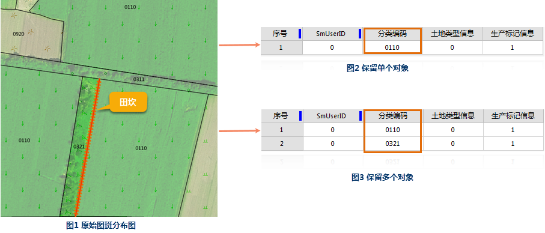

图层求交是指对两个及以上的数据集进行交集的分析功能。关于求交算子的详细介绍，具体内容请参见[叠加分析算子](Overlayoperation)。

### 使用说明

  * 交数据集类型必须为面数据集，待求交数据集的类型可以是点、线、面数据集。
  * 结果数据集中保留原来两个数据集重叠的部分。

### 功能入口

  * 在 **空间分析** 选项卡-> **矢量分析** -> **叠加分析** ，在弹出的“叠加分析”对话框中选择“求交”项。
  * **工具箱** -> **矢量分析** 工具-> **叠加分析** ->"求交"项；

###  参数说明

  * **源数据：** 选择待求交数据集所在的数据源及待求交的数据集。支持输入多个数据集进行求交分析。
  * **叠加数据：** 选择与源数据集进行“求交”的数据集及其所在的数据源。
  * **结果数据** ：选择存储结果数据集的数据源，指定结果数据集的名称
  * **字段设置** ：从源数据集及叠加数据集中选择字段作为结果数据集的字段信息。
  * **容限** ：根据参与分析的数据集，会自动给出默认的容限值。

叠加操作后，若两个节点之间的距离小于此值，则将这两个节点合并，该值的默认值为被裁剪数据集的节点容限默认值，该值可在数据集属性对话框的矢量数据集选项卡的数据集容限下的节点容限中设置。

若未在数据集属性中设置节点容限，则此处容限默认值与数据集的坐标系有关，具体说明请参见[容限说明](../../../DataProcessing/Tolerance)。

  * **进行结果对比** ：设置是否进行结果对比：勾选“ **进行结果对比** ”复选框，可将被擦除数据集、擦除数据集及结果数据集同时显示在一个新的地图窗口中，便于用户进行结果的比较。
  * **单个对象**：如果线在多个面对象内（面对象有重叠）或边界处，勾选“单个对象”表示只返回一个对象，否则返回多个对象。

例如：以下图1为例，田坎在分类编码为0321和0110两个图斑的交界处，现需要算出图斑的净面积，先算出图斑面积，需扣除线状田坎面积，线状田坎在图斑边缘，线状田坎的面积是只扣一半的，通过求交操作，若勾选“单一对象”则返回结果田坎只属于其中一个图斑如图2所示，如不勾选，则返回结果同时保留两个线对象如图3所示，再通过指定图斑ID，扣除对应图斑中线状地物面积，即可得到净面积的结果。

### 注意事项

在进行叠加分析前，请确保操作的数据投影信息保持一致，否则可能导致叠加分析失败。

###  相关主题

[关于叠加分析](AboutOverlay)

[叠加分析算子](Overlayoperation)

