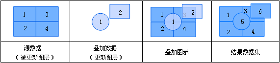
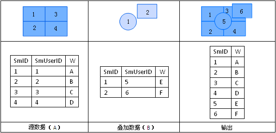

### 使用说明

更新运算是用更新数据集替换与被更新数据集重合的部分，是一个先擦除后粘贴的过程。结果数据集中保留了更新数据集的几何形状和属性信息。更新数据集及被更新数据集的类型必须为面数据集。 

  
  
更新运算输出结果的属性表如下图所示，A、B数据集几何对象重合部分的属性值更新为B的属性值。  

   

### 操作步骤

  1. 在“ **空间分析** ”选项卡上的“ **矢量分析** ”组中，单击“ **叠加分析** ”按钮，弹出“叠加分析”对话框，在弹出的对话框中选择"更新"项。

  2. 设置源数据。选择被更新数据集所在的数据源及被更新的数据集。

  3. 设置叠加数据。选择更新数据集所在的数据源及更新的数据集。

  4. 设置结果。选择存储结果数据集的数据源，指定结果数据集的名称。

  5. 设置容限值。根据参与分析的数据集，会自动给出默认的容限值。

叠加操作后，若两个节点之间的距离小于此值，则将这两个节点合并，该值的默认值为被裁剪数据集的节点容限默认值，该值可在数据集属性对话框的“矢量数据集”选项卡的数据集容限下的节点容限中设置。

若未在数据集属性中设置节点容限，则此处容限默认值与数据集的坐标系有关，具体说明请参见[容限说明](../../../DataProcessing/Tolerance.htm)。

  6. 设置是否进行结果对比。

勾选“ **进行结果对比** ”复选框，可将被更新数据集、更新数据集及结果数据集同时显示在一个新的地图窗口中，便于用户进行结果的比较。

  7. 单击“确定”按钮，完成更新操作。

###  注意事项

在进行叠加分析前，请确保操作的数据投影信息保持一致，否则可能导致叠加分析失败。

