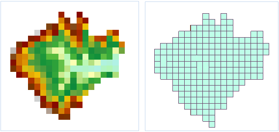

###  使用说明

对栅格数据类型的数据进行矢量化处理，可以将栅格数据集转化成点、线、面数据集。

打开“ExerciseData/RasterAnalysis”文件夹下的“Terrain”数据源，其中有分辨率为100米的 DEM
数据，我们用此数据来做示例。

###  功能入口

  * **空间分析** 选项卡-> **栅格分析** 组-> **矢栅转换** -> **栅格矢量化** 。
  * **工具箱** -> **栅格分析** -> **矢栅转换** -> **栅格矢量化** 。(iDesktopX) 

###  参数说明

  * 在“ **源数据** ”区域选择要进行处理的数据集。 
    * **数据源** ：在右侧下拉列表中，列出了当前工作空间下所有的数据源，选择将要被矢量化的栅格数据集所在的数据源。
    * **数据集** ：在右侧下拉列表中，列出了所选数据源中的栅格数据集和影像数据集，选择将要进行矢量化的数据集。
  * 在“ **结果数据** ”区域设置矢量化后生成的结果数据集的位置和名称。 
    * **数据源** ：选择保存矢量化生成的结果数据集所在的数据源位置。
    * **数据集类型** ：选择矢量化生成的数据集类型，可以是点数据集、线数据集、或者面数据集。
    * **数据集名称** ：为矢量化生成的结果数据集命名。
  * “ **矢量线设置** ”区域的参数只有在 **结果数据** 的“ **数据集类型** ”选择为“线数据集”的时候才生效。 
    * **光滑方法** ：只在栅格转为矢量线数据时有效，SuperMap 提供两种光滑处理的方法，“B 样条法”和“磨角法”，若想了解更多光滑过程可以参照[光滑方法说明](../../DataProcessing/Vector/SmoothMeth)文档。
    * **光滑系数** ：只在栅格转为矢量线数据时且“光滑方法”不是“不进行光滑”时有效，光滑系数的有效取值与光滑方法有关,当光滑方法为 B 样条法时，光滑系数的值小于 2 时将不会进行光滑；当采用磨角法时，光滑系数的值设置为大于等于 1 时有效。 光滑系数的值越大，则结果矢量线的光滑度越高。
    * **细化预处理** ：选中此选项，则在矢量化前先对栅格数据进行细化处理。细化处理可以减少栅格数据中标识线性对象的单元格的数量，提高矢量化的速度和精度。例如一幅扫描的等高线图上可能使用5、6个单元格来显示一条等高线的宽度，细化处理后，等高线的宽度就只用一个单元格来显示了。也可以预先对栅格/影像数据进行细化处理，然后再矢量化。关于栅格细化功能的介绍，请参阅[栅格细化](ThinRaster)。

  *  **栅格设置** ”区域的参数只对栅格数据集矢量化时生效，对影像数据集进行矢量化时不生效。 
    * **无值** ：对栅格数据集，像元值为此设定值的单元格被视为无值数据不参与矢量化过程。
    * **无值容限** ：“无值数据”设定好像元值后设置该“无值容限”值，则“无值数据”的像元值及容限范围内的像元值均视为不参与矢量化过程的数据单元。
    * **栅格值字段** ：用来将每个单元格的栅格值存储到结果数据集中的字段中。栅格值字段的名称在后面的文本框中指定。默认字段名称为 value。
    * **只转换指定栅格值** ：仅提取单元格值等于设定值的区域进行矢量化。 
      * 栅格值：像元值为此设定值的单元格参与矢量化过程。
      * 栅格值容限：设置指定“栅格值”的容限范围，在指定“栅格值"及浮动容限范围内的栅格值参与矢量化过程。
  * 在“ **影像设置** ”区域的参数只对影像数据集矢量化时生效，对栅格数据集进行矢量化时不生效。 
    * **背景色** ：对影像数据集，若遇到此种颜色的单元格，则将其视为背景色，不参与矢量化过程。 
    * **背景色容限** ：对于影像数据集选择了背景色后，数据集中若某个单元格的 RGB 值在背景色的浮动容限范围内，则该单元格也被作为背景色，不参与矢量化过程。容限值同时对应 RBG 三个值，比如容限值取10，那么颜色值（R±10、B±10、G±10 ）范围内的色值就是容限范围内，容限值取值范围（0～255）。
  * **环境设置** ：设置分析环境参数，栅格矢量化支持设置的分析环境参数包括结果数据集的地理范围、裁剪范围、默认输出分辨率等，具体操作请参见[设置分析环境](../Raster/AnalystEnvironment)页面。 

注意：支持将环境参数设置为全局变量，即将此处设置的参数值作为总栅格环境分析环境参数，其他支持环境参数设置的功能，无需再重复设置。如果在此处不设置环境参数，则分析时读取栅格分析环境中该参数的设置。

  