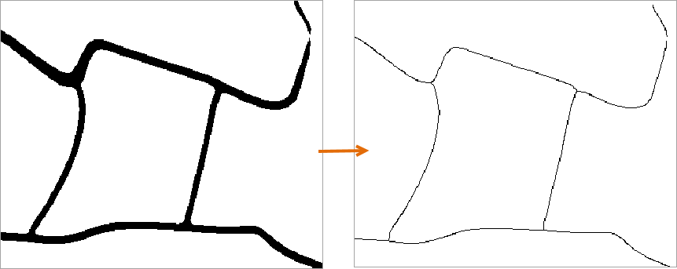

### 功能说明

二值栅格细化是处理二值图像的细化方法，若数据不是二值图像会先处理为二值图像，只需指定一个值为无值，除无值以外的值都是需要细化的值。二值栅格细化功能同时支持栅格数据和影像数据。

适用于道路数据的栅格细化，或用户源数据是二值栅格/影像数据，通过二值栅格细化的功能较于普通栅格细化的效率更快、更高效。

**功能入口**

单击 **空间分析** 选项卡-> **栅格分析** 组-> **矢栅转换** -> **二值栅格细化** 。

**参数说明**

在“二值栅格细化”对话框设置源数据、无值、容限及结果数据等参数，详细参数描述请参看[ **栅格细化**](ThinRaster.htm#1)。

**保存为栅格数据集** ：当源数据为影像数据集，勾选该复选框，生成结果数据集为栅格数据集。

### 应用实例

现有某区域的道路数据，需要对其做二值细化功能，细化处理可以减少栅格数据中用于标识道路像元的数量，从而提高矢量化的速度和精度。设置二值栅格细化相关参数的设置后，得到如下图所示的结果。

  

  
### 注意事项

  * 无值的容限是用户指定的无值的值的容限，与栅格中原无值无关。
  * 建议用户点击“拾取”按钮，拾取已打开的栅格数据集的值设置“无值”，若用户输入的无值是数据集像元值不存在的值，则计算结果会不正确，或者不能进行栅格细化。

