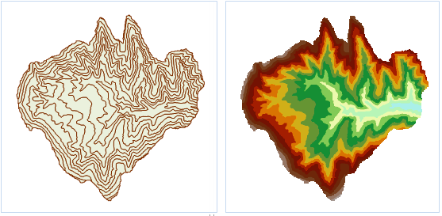

### 使用说明

将矢量数据集转换为栅格数据集。

打开“ExerciseData”>“RasterAnalysis”文件夹下的“Terrain”数据源，其中有分辨率为100米的 DEM
数据，我们用此数据来做示例。

### 功能入口

  * **空间分析** 选项卡-> **栅格分析** 组-> **矢栅转换** -> **矢量栅格化** 。
  * **工具箱** -> **栅格分析** -> **矢栅转换** -> **矢量栅格化** 。(iDesktopX) 

### 参数说明

  * 源数据
    * **数据源** ：列出当前工作空间中所有的数据源，选择需要栅格化的矢量数据集所在的数据源。
    * **数据集** ：列出所选数据源中所有的矢量数据集，选择需要栅格化的矢量数据集，这里会自动定位到工作空间管理器内选中的数据集。
    * **栅格值字段** ：列出了源数据集中所有的字段名称，选取一个字段值作为结果数据集的像元值。 **注意：** 栅格值字段中的数值范围需要与像素格式相匹配，即栅格字段值的取值范围需要位于结果数据集的像素格式的存储范围内，一旦栅格字段值超出结果数据集“像素格式”的存储范围时，对应像元的栅格值将被处理成0。例如，“像素格式”设置为“4位”时，其存储范围为[0,15]，共16个整数。若某个字段值为20（超出“4位”像素格式的存储范围），则该字段值对应的像元栅格值将被处理成0。
  * 结果数据
    * **数据源** ：列出了当前工作空间的所有数据源，选择结果数据集所在的数据源。默认与源数据源相同。
    * **数据集** ：设置结果数据集的名称，结果数据集为栅格数据集（GRID）。
  * 参数设置
    * **边界数据源** ：列出了当前工作空间下所有的数据源，选择边界数据集所在的数据源。
    * **边界数据集** ：选择边界数据集，必须为面数据集。通过选择边界数据集，可以仅对源数据集与边界数据集相交的部分进行栅格化操作。
    * **将选中的面对象作为边界** ：以选中对象的范围作为栅格化操作的边界，对所选源数据集进行栅格化操作。  在地图窗口中选中一个或多个面对象以后，打开矢量栅格化对话框，将默认勾选“将选中的面对象作为边界”复选框，此时栅格化范围仅限地图窗口中所选面对象的并集，对话框右侧参数设置区域的边界数据源和边界数据集将自动定位到所选面对象所在的数据集，且二者变灰呈不可修改状态。若栅格化之前未在地图窗口中选中面数据集，则该功能不可用。
    * **像素格式** ：设置结果数据集的像素格式。包括：1位、4位、单字节、双字节、整型、长整型、单精度浮点型和双精度浮点型等8种。用户可根据实际需求选择合适的像素格式，像素格式的具体说明请参见[栅格数据集像素格式](PixelFormat)。
    * **分辨率** ：设置栅格数据集的分辨率。默认分辨率的计算公式是 L/500，其中，L 表示边界长度，取结果数据集的区域范围内宽（Width）和高（Height）之间最大的边的值，500表示边界 L 所容纳单元格的默认数量，计算结果为每个像元的大小。此外，用户也可以自行调整结果数据集分辨率的大小。分辨率的单位与源数据集的地理单位相同。
  * **环境设置** ：设置分析环境参数，矢量栅格化支持设置的分析环境参数包括结果数据集的地理范围、裁剪范围、默认输出分辨率等，具体操作请参见[设置分析环境](../Raster/AnalystEnvironment)页面。 

注意：支持将环境参数设置为全局变量，即将此处设置的参数值作为总栅格环境分析环境参数，其他支持环境参数设置的功能，无需再重复设置。如果在此处不设置环境参数，则分析时读取栅格分析环境中该参数的设置。

  