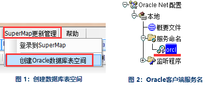

数据库管理功能主要包括：创建基础数据库、登录到SuperMap、注册地理数据库、创建图层，详细操作说明如下：

### 创建基础数据库

**操作步骤**

  1. 启动EPS，新建工程后，选择SuperMap更新管理菜单下的“创建Oracle数据库表空间”，弹出创建对话框；   

   

  2. 在创建对话框中，填写各项值：实例名称、系统管理员名称、系统管理员口令、新建数据库名称、新建数据库用户名称、新建数据库口令、设置表空间大小、表空间文件放置路径，点击“开始创建”执行。  
      

  
**注意** 

  * “输入Oracle实例名称”，输入的实例名是 Oracle 32 位客户端中 Net Manager 的服务命名（见上图3），保持一致，否则，会提示监听错误。
  * 表空间文件放置路径应到达“\oradata\”下即可。
3. 创建成功之后，详细信息会输出到输出窗口中。 
   

### 登录到SuperMap

**操作步骤**

  1. “SuperMap更新管理”菜单→“登录到SuperMap”，弹出“登录到SDX+数据库”对话框，如下图所示： 
     
  2. 进行连接设置，单击“设置”按钮，弹出连接参数设置对话框，填写设置参数后，可使用“测试连接”按钮对参数的正确性进行验证,测试成功后，点击“保存”按钮保存连接参数，关闭对话框；
  

  3. 登录连接，单击“登录”按钮进行数据库连接，登录后，菜单目录如下图所示：
  

### 注册地理数据库

将已有的地理数据库加入到系统的管理目录（列表）中，作为入库和更新的数据源。

**操作步骤**

  1. “SuperMap更新管理”菜单→“系统管理”→“数据库管理”，添加基础数据库到数据源列表；
  2. 选取“数据管理”鼠标右键，点击“注册地理数据库；
  3. 在注册对话框中填写连接参数，并验证，确定添加。 **注意** ：表空间类型的取值：基础数据库（500比例尺的数据库、1000、2000比例尺数据库），按所添加数据库的内容和用途进行选取。
  

### 创建图层

将数据库添加数据管理列表后，就可以连接数据库，初始化数据库结构了，使用相关模板创建数据库需要的图层和信息表。

**操作步骤**

  1. 数据源列表中的 DLG_500 数据库的右键菜单→“创建图层”。
  2. 连接数据库，鼠标双击 DLG_500 数据库，启动图层创建功能，在数据库的右键菜单中执行“创建图层”；
  3. 选择创建图层模板，依次进行图层选择、关联表选择、缺省系统字段设置，然后再选择投影信息；
  

  4. 开始创建，单击“开始创建”进行DLG_500数据库图层的创建。
  
