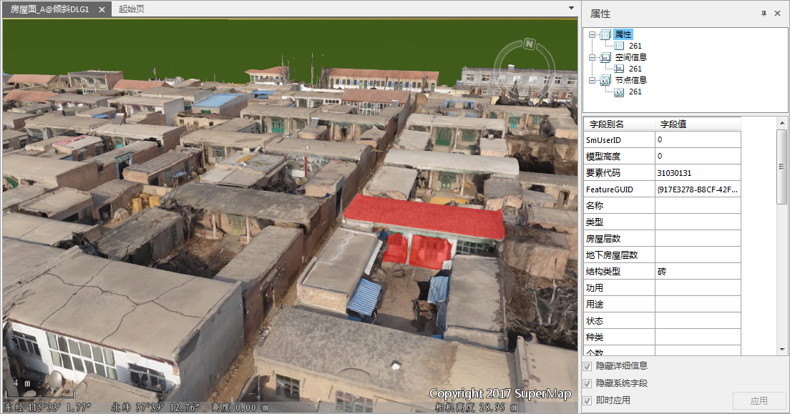

EPS的房屋面数据，支持与对应的倾斜摄影数据进行叠加，实现单体化查询。

### 操作步骤

  1. 将房屋面数据添加到三维场景中；
  2. “场景”选项卡->“数据”分组中，单击“缓存”下拉按钮，选择“加载缓存…”，选择已经生成的倾斜摄影scp文件，添加到场景中；
  3. 图层管理器中，将房屋面图层调整到倾斜摄影图层之上，并选中；
  4. “风格设置”选项卡->“拉伸设置”分组中，设置“高度模式”为“贴对象”；
  5. “填充风格”分组中，设置“透明度”为100，“填充模式”为“填充”；
  6. 图层管理器中，选中房屋面数据集，在右键菜单中单击“对象选择风格”，在弹出的对话框中，设置透明度为50。 

**注** ：此步骤的目的是为了在场景中选中对象时，显示风格更美观，对象选择风格中的“前景色”、“线颜色”也都可以根据需要设置。

  7. 在场景中的倾斜摄影模型上点击，有矢量房屋数据的模型就会呈现高亮选中；双击，则会弹出此对象的属性信息，实现单体化查询，如下图所示。
  
