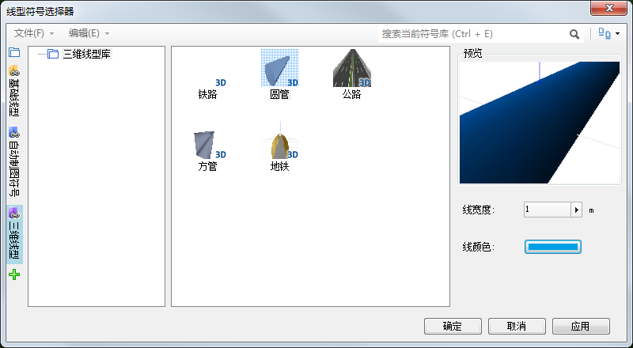
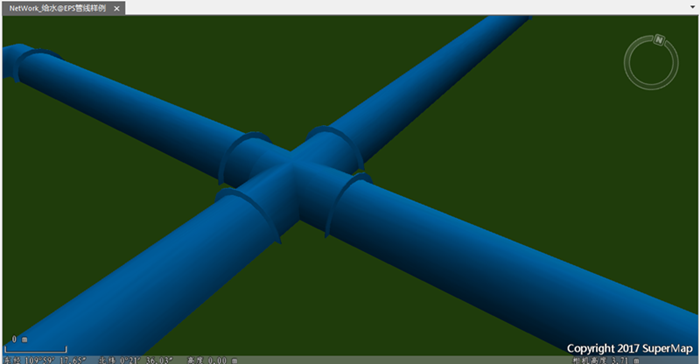

本小节以生成的[三维网络数据集](EPSBuildNetworkData.html)为例，来说明如何在三维场景中快速构建三维管线。

### 操作步骤

  1. 添加三维网络数据集到三维场景中；
  2. 图层管理器中，选中网络数据集的线子数据集，点击右键菜单中的“图层风格…”;
  3. 在弹出的风格设置对话框中，在左侧选择“三维线型”分组，会加载三维线型符号库。在右侧的线型面板中，选择“圆管”，设置“线颜色”为蓝色。如下图所示。 
  

  4. 场景中管线拉近放大后，可以看到管线相接的地方会自动连接，即实现管点自适应，如下图所示。 **注意** ：物探点号、管线编号、起点号、终点号四个字段，是EPS管线数据自带的文本型字段。   
     

  5. 点击“确定”，生成三维管线网络数据集，下图分别为：三维管线网络数据集在打开在地图窗口及在场景中打开。 注：生成的三维管线网络数据集在三维场景中的应用，请查看[构建三维管线](../../SceneOperation/Pipe3D/PipeStyle)页面。 
  
---  

  
也可以通过【风格设置】选项卡中的【线风格】，修改管线的颜色、透明度、线宽等参数。根据实际需求，设置管线的高度模式，以及管线是否是位于地下，开启地下设置。

