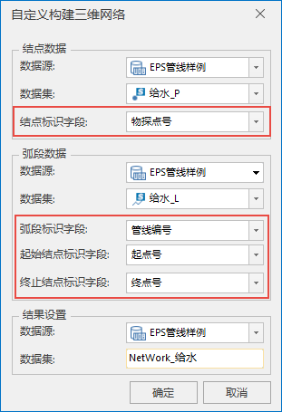
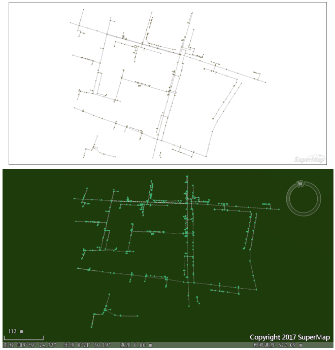

通过 EPS 平台生产的管线数据，在 SuperMap iDesktop 中支持通过“自定义构建三维网络”的方式，生成三维网络数据集，进而添加到三维场景中，快速构建管网。

本小节将以 EPS 管线数据为例，介绍三维网络数据集的构建过程。EPS管线数据包含了管点以及对应的管线，管点数据集中的“物探点号”，管线数据集中的“管线编号”、“起点号”以及“终点号”，这四个属性字段是成功构建网络数据集的必须字段。

### 操作步骤

  1. “交通分析”选项卡→“路网分析”分组→“拓扑构网”下拉按钮中，选择“自定义构建三维网络”选项。 
  2. 以对给水管点、管线数据构建三维网络数据集为例，弹出的对话框中，参数设置下图所示，图中红框内的参数设置，是需要重点注意的地方，是成功构建网络数据集的条件。 **注意** ：物探点号、管线编号、起点号、终点号四个字段，是EPS管线数据自带的文本型字段。  
      
  3. 点击“确定”，生成三维管线网络数据集，下图分别为：三维管线网络数据集在打开在地图窗口及在场景中打开。 注：生成的三维管线网络数据集在三维场景中的应用，请查看[构建三维管线](../../SceneOperation/Pipe3D/PipeStyle)页面。 
  

