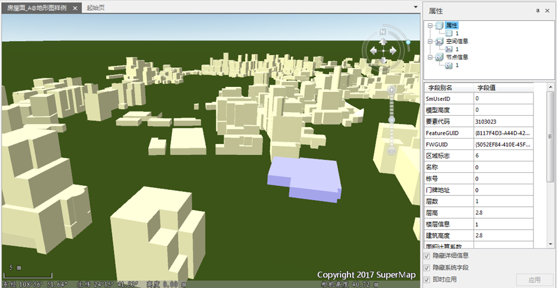
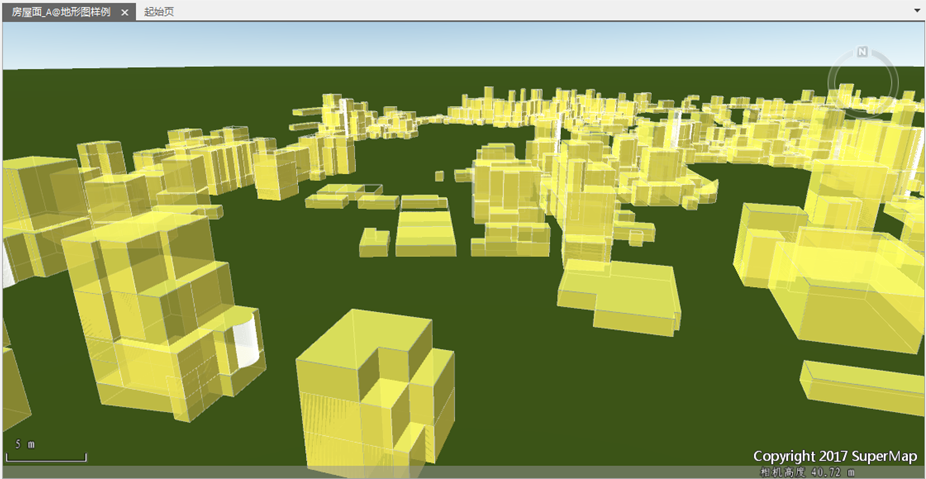

EPS数据集均可以直接添加到三维球面场景中（注：数据集的坐标系需为经纬度或者投影），设置图层风格在场景中显示、浏览。本小节中，以房屋面数据集为例，来说明如何对EPS中的面数据集快速建模。

### 操作步骤

  1. 数据源中选择房屋面面数据集，右键菜单中选择“添加到新球面场景”。
  2. 在“风格设置”选项卡→“拉伸设置”分组中，设置“高度模式”为“绝对高度”，“拉伸高度”中选择“建筑高度”，房屋面数据被拉伸为模型，建模效果如下图所示。 **注** ：“建筑高度”为房屋面数据集的属性字段；“底部高程”可以根据数据的实际情况进行设置。  
      

  3. 支持对拉伸后的模型选中，进行属性查询，如图2所示。除此之外，也可以对模型的颜色、透明度、填充模式等填充风格进行设置。如下图为：修改填充前景色为黄色，透明度为20，填充模式为“填充与轮廓”。   
     

