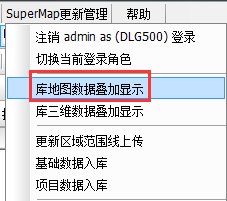
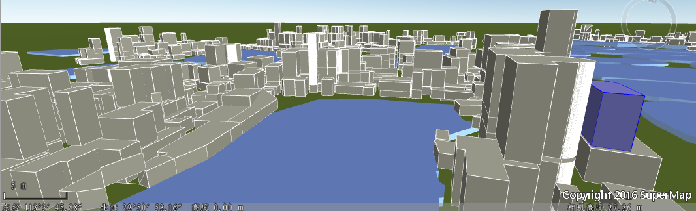

### 库地图数据叠加显示

当导入显示配置smwu文件成功后，按提示注销登录，在“SuperMap更新管理菜单”肩→“登录到SDX+数据库”→“登陆smdlg500数据库”，点击“库地图数据叠加显示”进行数据浏览。/p>

**操作步骤** ：“Super Map更新管理”→“系统管理”→“权限管理”。

  

  
### 库三维数据叠加显示

当导入显示配置smwu文件成功后，按提示注销登录，在“SuperMap更新管理菜单”→“登录到SDX+数据库”→“登陆sm3D数据库”，点击“库三维数据叠加显示”进行数据浏览。

  
