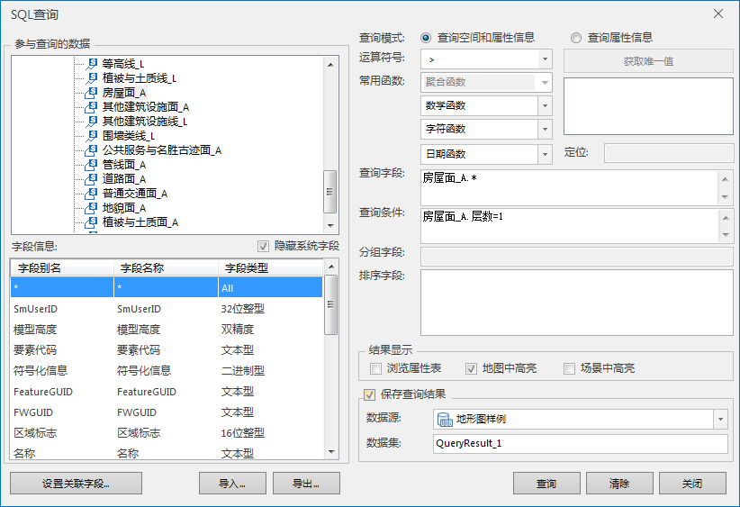
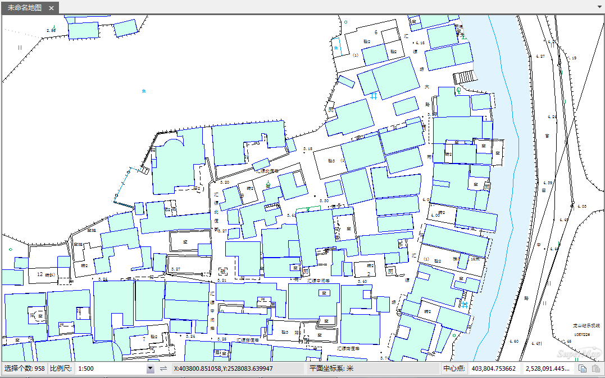
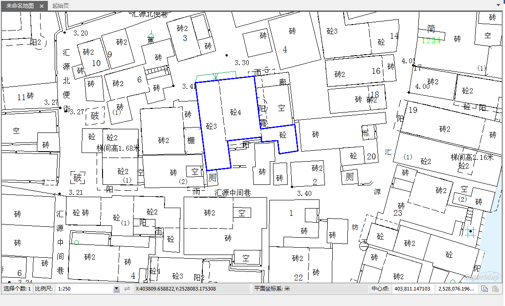
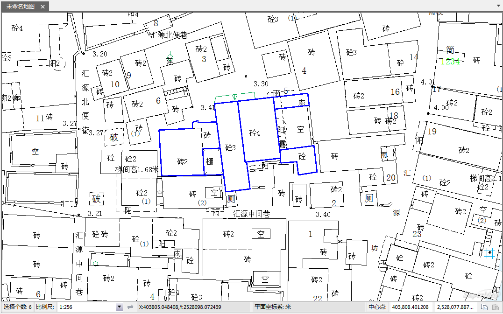
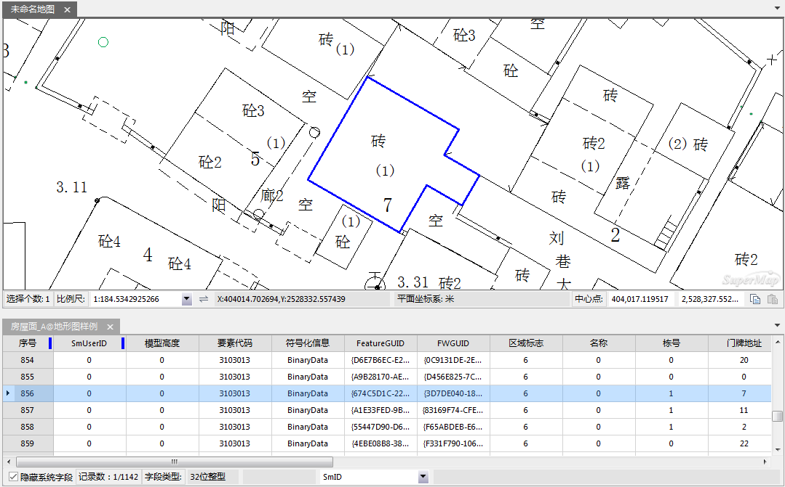

EPS 数据集，支持进行 SQL查询、空间查询、关联浏览查询等查询操作。

### SQL 查询

与SuperMap
iDesktop中的普通数据集SQL查询方式一致：在SQL查询对话框中，选择参与查询的数据，设置查询字段、查询条件等参数，设置结果显示的方式、保存查询结果。

如下图所示，查询房屋面数据集中层数为1的房屋及查询结果。

  

  

  
### 空间查询

针对EPS数据集的空间查询，也与SuperMap iDesktop中普通数据集的空间查询方式一致：在地图窗口先选中一个或者多个对象作为搜索图层，再在空间查询对话框中设置参与查询的图层以及空间查询条件，设置结果显示的方式、保存查询结果。

实例：在地图上先选中一个房屋面对象，查询房屋面数据集中与之相交的其他对象。  
下图为在地图上选中查询对象：  

  

下图为空间查询结果在地图上高亮显示：

  

  
### 关联浏览查询

将EPS数据集添加到地图窗口之后，通过图层右键菜单中的“关联浏览属性数据”，可以实现空间数据与属性数据的关联查询：在地图上选中对象，可查看对应的属性；在属性表中选中一条属性记录，与之关联的空间对象会在地图中高亮显示。

  

