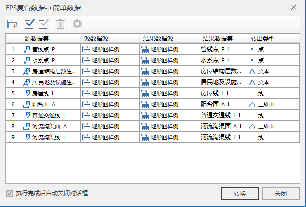

EPS复合数据集支持转换为二维或三维的点、线、面，以及文本数据集，在 SuperMap iDesktop
中针对矢量数据的数据处理、查询、分析等操作都可以使用。也可以将数据配置为天地图风格的电子地图，并发布为地图服务进行浏览。

### 操作步骤

  1. “数据”选项卡->“数据处理”分组->“类型转换”下拉菜单中，在“CAD数据复合数据与简单数据互转”分组中，选择“EPS复合→简单”。
  2. 在弹出的对话框中，选择添加要进行类型转换的 EPS 数据，设置结果数据源、结果数据集名称、转出类型等参数。 **注意** ：EPS复合点、线、面数据集的转出类型可选择转为二维的点、线、面或者三维的点、线、面。  
  
 
  3. 点击“转换”，完成数据集类型的转换操作。

